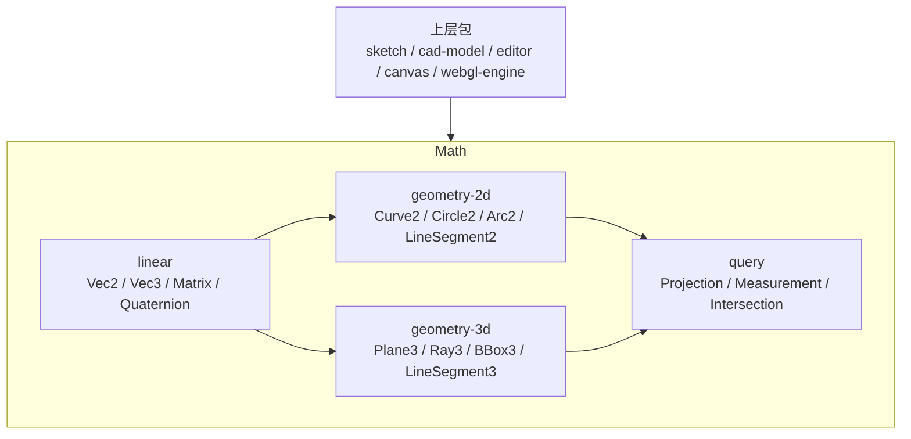

# math 包架构设计

## 文档目的

`@occt-draw/math` 是项目的底层数学与几何算法包。它不依赖任何 workspace 包，也不包含 CAD 文档、草图、编辑器或渲染业务语义。

上层包可以依赖 `math` 的几何对象和算法，但 `math` 不能反向依赖 `sketch / cad-model / editor / canvas / webgl-engine`。

## 当前定位

`math` 当前主要承担：

- 向量、矩阵、坐标系、平面、射线等基础数学对象。
- 2D / 3D 几何对象。
- 测量、投影、相交、包围盒等几何查询。
- 曲线参数和曲线采样算法。

它应该提供稳定、可组合、可测试的几何基础能力，而不是承载 CAD 业务流程。

## 当前模块分层



## 2D 几何能力

当前 `geometry-2d` 公开了：

- `Curve2`
- `BoundedCurve2`
- `Line2`
- `LineSegment2`
- `Circle2`
- `Arc2`
- `Ellipse2`
- `EllipticalArc2`
- `Bezier2`
- `BSpline2`
- `Nurbs2`
- `Polyline2`
- `Polygon2`
- `BBox2`
- `CurveParameter`
- `ParameterDomain`

其中，`Curve2` 是 2D 曲线抽象，曲线对象应提供参数采样能力，上层不应为不同曲线重复实现点采样。

## 曲线采样

当前 `math` 已提供：

```ts
sampleCurveSegments2(curve, options);
```

它将 `Curve2` 离散为 `LineSegment2[]`。

当前采样选项：

```ts
interface CurveSegmentSamplingOptions {
    readonly closed?: boolean;
    readonly segments?: number;
}
```

当前策略以固定段数为主：

- `closed: true` 时，不包含曲线终点，用最后一个采样点连接第一个采样点。
- `closed: false` 时，包含终点，并生成相邻采样点之间的线段。

## 与 sketch 包的关系

`math` 只处理纯数学曲线，不认识 `Sketch / Circle2D / Curve2D / Edge / Vertex` 等 sketch 领域对象。

`sketch` 包负责把自身的曲线模型适配到 math：

```txt
sketch Curve2D / Circle2D
  -> math Curve2 / Circle2
  -> sampleCurveSegments2(...)
  -> LineSegment2[]
```

当前 `sketch` 中已有：

```ts
sampleSketchCurveSegments(...)
```

它负责识别 sketch 曲线对象，并调用 math 的曲线采样能力。

## 设计原则

1. `math` 只放通用数学和几何算法。
2. 不在 `math` 中引入 `sketch` 领域类型。
3. 曲线采样算法优先放在 `math`。
4. 曲线对象到业务显示模型的适配放在 `sketch / canvas / cad-canvas`。
5. 采样结果使用通用几何类型，例如 `LineSegment2`，不要返回渲染对象。
6. 上层包不应重复实现圆、圆弧、样条等曲线离散逻辑。

## 后续优化方向

当前 `sampleCurveSegments2` 仍是固定段数采样，后续应补充更适合 CAD 显示和拾取的策略：

### 1. 最大弦高误差采样

新增基于 `maxDeflection` 的采样选项：

```ts
interface CurveSegmentSamplingOptions {
    readonly closed?: boolean;
    readonly segments?: number;
    readonly maxDeflection?: number;
    readonly minSegments?: number;
    readonly maxSegments?: number;
}
```

对圆可以根据弦高误差计算段数：

```txt
theta = 2 * acos(1 - maxDeflection / radius)
segments = ceil(2π / theta)
```

### 2. 最大角度采样

对圆、圆弧、椭圆弧支持 `maxAngle`，避免大圆采样过粗。

### 3. 自适应采样

对 Bezier、BSpline、Nurbs 后续需要引入自适应采样，根据曲率或误差递归细分。

### 4. 采样测试

补充单测覆盖：

- 固定段数采样。
- closed / open 曲线端点处理。
- 圆的采样段数。
- degenerate 半径或非法参数。
- maxDeflection 后续新增后的段数计算。

## 非目标

`math` 不负责：

- CAD 文档编辑事务。
- 草图实体存储。
- Sketch Feature / Payload 查询。
- WebGL 渲染对象生成。
- 约束求解器。
- OCCT B-Rep、布尔、倒角、圆角等几何内核能力。
