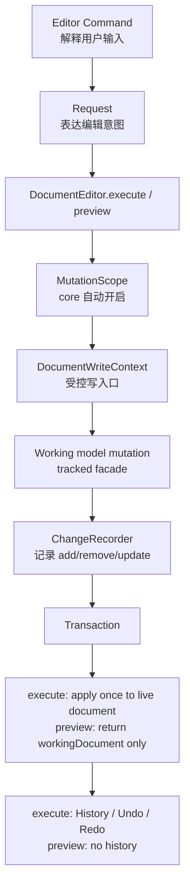

# 文档编辑事务架构重构方案

## 背景

当前项目已经完成一轮重要收口：

- `CadDocumentEditContext` 已把 Sketch 修改从 `SketchEdit -> Transaction<Sketch> -> map Transaction<CadDocument>` 收敛为 Document 级 Request 内部编辑上下文。
- `SketchPrimitiveBuilder` 已承担点、顶点、曲线、边等草图基础对象创建。
- `SketchEdit` 类族已不再作为主要 public 编辑入口。
- `ModelChangeSet` 已有 `targetKind`、`toSerializable()` 和 `ModelChangeApplierRegistry` 雏形。

但当前架构仍然是过渡形态：

```txt
Request.execute()
  -> CadDocumentEditContext.begin()
  -> requireSketchTarget()
  -> target.primitives.xxx()
  -> finish()
  -> RequestExecution { transaction, result }
  -> DocumentSession.execute() 应用 transaction
```

问题是：`Request` 仍然参与事务生成，业务层仍能看到 begin / finish / target / primitive 等事务细节。长期目标是：

```txt
Command -> Request -> 修改模型
                  ↓
          core 自动记录 change
                  ↓
          core 自动生成 transaction
                  ↓
          history / undo / redo
```

业务 Request 只表达“我要如何修改数据”，不手动创建、返回或组装 transaction。

## 核心原则

### 1. CadDocument 是正式聚合根

当前正式文档边界是 `CadDocument`。

在 Sketch 中新增一条线，本质是修改 `CadDocument` 内部的 Sketch payload，应表现为一个 Document 级 Request：

```txt
SketchAddLineCommand
  -> AddSketchLineRequest<CadDocument>
  -> DocumentEditor.execute(request)
  -> core 自动记录 model changes
  -> core 自动生成 Transaction<CadDocument>
```

不采用正式业务入口：

```txt
ApplySketchRequest<CadDocument>
  -> AddLineSegmentRequest<Sketch>
```

除非未来 Sketch 变成独立保存、独立 undo/redo 的子文档，否则不要引入正式 `Request<Sketch>`。

### 2. Request 不返回 transaction

新的业务 Request 只返回业务结果：

```ts
abstract class DocumentRequest<TDocument, TResult> {
    abstract readonly id: string;
    abstract readonly label: string;
    abstract execute(context: DocumentWriteContext<TDocument>): TResult;
}
```

Request 不调用 `begin()`、不调用 `finish()`、不创建 `Transaction`、不写入 History。

### 3. MutationScope 不直接修改 live document

必须明确三种对象：

```txt
live document
  DocumentEditor 当前持有的正式文档。

working document / working model
  MutationScope 内部使用的可写工作副本或 copy-on-write facade。

transaction
  对 live document 的唯一正式变更描述。
```

原则：

```txt
request.execute(ctx) 只修改 working document / tracked facade。
scope.commit() 只生成 transaction，不修改 live document。
DocumentEditor 只通过 transaction.apply(live document) 更新 live document 一次。
History 记录同一个 transaction。
```

禁止出现：

```txt
request 已经修改 live document
commit 后又 apply transaction
```

这种设计会导致双重 apply。

### 4. Preview / dryRun 是正式能力

编辑器预览、拖拽中的 `EditDraft.workingDocument`、hover/drag 试算等场景需要“试执行 Request”。

因此 `DocumentEditor` 必须提供非提交式预览入口：

```txt
preview(request)
  -> 在 MutationScope 的 working document / tracked facade 上执行 request
  -> 生成 result、workingDocument、transaction
  -> 不 apply live document
  -> 不写入 history
  -> 异常时 discard scope
```

预览和正式执行必须使用同一套 Request 和模型修改逻辑，避免 editor 为预览重复实现一套临时数据修改逻辑。

## 目标架构



## 概念定义

### DocumentEditor

替代或重命名当前 `DocumentSession` 的核心职责。

职责：

- 持有 live document。
- 统一执行 Request。
- 自动打开 MutationScope。
- 自动生成 Transaction。
- `execute()` 只通过 Transaction 更新 live document。
- `preview()` 返回预览结果，不修改 live document。
- 自动写入 History。
- 提供 undo / redo / beginScope / commitScope / cancelScope。

建议 API：

```ts
class DocumentEditor<TDocument> {
    execute<TResult>(request: DocumentRequest<TDocument, TResult>): DocumentRequestResult<TResult>;
    preview<TResult>(
        request: DocumentRequest<TDocument, TResult>,
    ): DocumentPreviewResult<TDocument, TResult>;
    undo(): DocumentEditResult<TDocument>;
    redo(): DocumentEditResult<TDocument>;
    get document(): TDocument;
}

interface DocumentPreviewResult<TDocument, TResult> {
    readonly result: TResult;
    readonly workingDocument: TDocument;
    readonly transaction: Transaction<TDocument>;
}
```

### MutationScope

底层自动记账环境。业务代码不直接创建或操作它。

职责：

- 在 `DocumentEditor.execute(request)` 或 `DocumentEditor.preview(request)` 内部自动创建。
- 基于 live document 创建 working document 或 copy-on-write facade。
- 持有 ChangeRecorder。
- 给 Request 提供 `DocumentWriteContext`。
- 收集 working model 上的 add/remove/update。
- commit 时生成 Transaction。
- commit 不修改 live document。
- 为 preview 提供 workingDocument。

正式执行伪代码：

```ts
execute(request) {
    const scope = MutationScope.begin(this.document, request);

    try {
        const result = request.execute(scope.context);
        const transaction = scope.commit();
        this.document = transaction.apply(this.document);
        this.history.record(transaction);
        return { result, transaction };
    } catch (error) {
        scope.discard();
        throw error;
    }
}
```

预览伪代码：

```ts
preview(request) {
    const scope = MutationScope.begin(this.document, request);

    try {
        const result = request.execute(scope.context);
        const transaction = scope.commit();
        return {
            result,
            transaction,
            workingDocument: scope.workingDocument,
        };
    } catch (error) {
        scope.discard();
        throw error;
    }
}
```

空 transaction 不应写入 history。预览即使产生非空 transaction，也不写入 history。

### DocumentWriteContext

Request 的受控写入口。

职责：

- 提供文档内部对象访问能力。
- 屏蔽 `PartStudio / Feature / Payload / Plane` 的穿透查询细节。
- 返回 tracked write facade。
- 不暴露 transaction、history、changeSet。
- 不暴露 raw mutable model。

建议：

```ts
interface CadDocumentWriteContext {
    requireSketch(sketchFeatureId: FeatureId): SketchWriteTarget;
    requirePartStudio(partStudioId: PartStudioId): PartStudioWriteTarget;
}

interface SketchWriteTarget {
    readonly id: SketchId;
    readonly featureId: FeatureId;
    readonly plane: Plane3;
    addLineSegment(input: SketchLineSegmentInput): SketchPrimitiveResult;
    addCircle(center: Vector2, radius: number): SketchPrimitiveResult;
    moveVertex(vertexId: SketchVertexId, target: Vector2): SketchPrimitiveResult;
    deleteEntity(ref: SketchEntityRef): SketchPrimitiveResult;
}
```

## 写入口强制策略

“所有模型修改必须通过 tracked API”不能只靠约定，必须靠类型和封装强制。

要求：

1. Request 拿到的是 write facade，不是 raw `CadDocument / PartStudio / Sketch / Point2D`。
2. 实体属性尽量 `private` 或 `readonly`。
3. 属性修改必须走方法，例如 `point.setPosition(next)`，禁止 `point.position = next`。
4. Store 写入必须走 tracked store 或 write facade。
5. Read facade 和 Write facade 分离。
6. `SketchPrimitiveBuilder` 不应暴露给 editor 直接修改正式模型。
7. 新增模型 mutation API 时必须同时接入 change recorder。

示例：

```ts
point.setPosition(next);
```

底层自动记录：

```txt
kind: update
ref: point.ref
propertyPath: ['position']
before: oldPosition
after: next
```

新增对象：

```ts
store.add(edge);
```

底层自动记录：

```txt
kind: add
ref: edge.ref
value: edge.snapshot()
```

删除对象：

```ts
store.remove(edgeId);
```

底层自动记录：

```txt
kind: remove
ref: edge.ref
value: oldSnapshot
```

## ChangeSet 与 ApplierRegistry

tracked mutation 的目标产物应直接对齐可序列化 change，而不是继续扩大 runtime target function 依赖。

原则：

- Change 应尽量是纯数据 patch。
- Change 至少包含 `targetKind / ref / kind / before / after / value / propertyPath`。
- apply/revert 通过 `ModelChangeApplierRegistry` 根据 `targetKind` 执行。
- 旧 `ModelChangeSet` 中的 runtime target function 只作为迁移期兼容层。

目标形态：

```txt
Tracked mutation
  -> SerializableModelChangeSet
  -> Transaction
  -> ModelChangeApplierRegistry.apply/revert
```

不要先大规模写入 runtime target function，再在后期整体返工。

## 包职责

### core

负责通用编辑基础设施：

- `DocumentEditor`
- `DocumentRequest`
- `MutationScope`
- `DocumentWriteContext`
- `ChangeRecorder`
- `Transaction`
- `History`
- tracked store / tracked property 基础能力
- `ModelChangeApplierRegistry`
- serializable change set
- request preview / dryRun 能力

### cad-model

负责 CAD 文档聚合根与文档级 Request：

- `CadDocument`
- `PartStudio`
- `Feature`
- Sketch payload 定位
- `CadDocumentWriteContext`
- `AddSketchLineRequest`
- `AddSketchCircleRequest`
- `AddSketchRectangleRequest`
- `DeleteSketchEntityRequest`
- `MoveSketchVertexRequest`

### sketch

负责 Sketch 数据模型和领域构造：

- `Sketch`
- `Point2D / Curve2D / Vertex / Edge`
- `SketchPrimitiveBuilder`
- `SketchGeometryValidator`
- 不负责 document transaction
- 不暴露正式编辑 Request 入口

### editor

负责交互编排：

- Command 解释输入。
- 创建 Document Request。
- 维护临时交互状态。
- 维护 EditDraft 预览。
- 通过 `DocumentEditor.preview(request)` 生成 working document。
- 不直接修改模型。
- 不处理 transaction。

## 分阶段实施计划

### 阶段 1：兼容层与类型先行

目标：建立新架构类型，不立即迁移业务 Request。

任务：

1. 新增 `DocumentEditor`，先包装现有 `DocumentSession`。
2. 新增 `DocumentRequest<TDocument, TResult>`，但暂不迁移业务。
3. 新增 `MutationScope`、`DocumentWriteContext` 类型草案。
4. 新增 `DocumentEditor.preview(...)` 类型草案。
5. legacy `Request` 继续按旧链路执行。
6. `DocumentEditor.execute()` 同时支持 legacy Request。
7. legacy preview 可以临时复用旧 `request.execute(...).transaction.apply(...)`，但必须封装在 `DocumentEditor.previewLegacy(...)` 或等价内部兼容层中，不允许散落在 editor command 里。
8. 新 DocumentRequest 只在 MutationScope 能生成 transaction 后再开放业务迁移。
9. 为 core 增加测试，覆盖 legacy execute / undo / redo / preview 基础流程。

验收：

- `pnpm check` 通过。
- 新旧接口可以并存。
- 现有草图功能不受影响。
- 没有业务 Request 被迫迁移到半成品新接口。
- editor 预览链路有统一入口，不再直接手写 request execute + transaction apply。

### 阶段 2：serializable change + tracked mutation 底座

目标：同时建立 tracked mutation 和可序列化 change 体系，避免后续返工。

任务：

1. 明确 `SerializableModelChangeSet` 为 tracked recorder 的目标产物。
2. 完善 `ModelChangeApplierRegistry`，支持 add/remove/update apply/revert。
3. 为 `targetKind` 建立注册规则和测试。
4. 为 `ModelElementStore` 增加 tracked add/remove 机制。
5. 为模型属性增加 tracked set 机制。
6. update 必须记录 propertyPath、before、after。
7. add/remove 必须记录 ref、targetKind、snapshot。
8. 不新增依赖 runtime target function 的 recorder。

验收：

- 新增对象、删除对象、修改属性都能生成 serializable change。
- registry apply/revert 可工作。
- 覆盖单测：add、remove、update、update merge、revert、serialization。

### 阶段 3：实现 MutationScope 生命周期

目标：明确 working document 与 live document 的关系，避免双重 apply。

任务：

1. `MutationScope.begin(liveDocument, request)` 创建 working document 或 copy-on-write facade。
2. `request.execute(ctx)` 只能修改 working document / tracked facade。
3. `scope.commit()` 只生成 transaction。
4. `scope.workingDocument` 返回预览用 working document。
5. `DocumentEditor.execute()` 只通过 transaction apply live document 一次。
6. `DocumentEditor.preview()` 返回 result、workingDocument、transaction，不 apply live document，不写 history。
7. request 失败时 discard scope，live document 不变。
8. 空 transaction 不进入 history。

验收：

- 不存在 request 修改 live 后又 apply transaction 的路径。
- 异常时 live document 不变。
- execute 中 transaction apply 只发生一次。
- preview 不修改 live document、不写 history。
- undo/redo 行为正确。

### 阶段 4：迁移 CadDocument Sketch Request

目标：业务 Request 不再手动 begin / finish / transaction。

任务：

1. 将 `AddLineSegmentRequest` 等逐步迁移为新 `DocumentRequest`。
2. Request 内只写：
    - `ctx.requireSketch(...)`
    - `sketch.addLineSegment(...)`
3. 移除 Request 内部的 `CadDocumentEditContext.begin()` 和 `finish()`。
4. `SketchPrimitiveBuilder` 只调用 tracked model API。
5. editor 命令层继续只创建 request。
6. editor 需要预览时调用统一 `DocumentEditor.preview(request)`。

验收：

- 草图线、圆、矩形、删除、移动点行为不变。
- Request 不返回 transaction。
- transaction 由 DocumentEditor 自动生成。
- EditDraft.workingDocument 由 preview 入口生成。

### 阶段 5：淘汰 CadDocumentEditContext 手动事务职责

目标：移除当前 edit context 的 begin / requireTarget / finish 手动事务流程。

任务：

1. 若仍需上下文能力，将其更名为 `CadDocumentWriteContext`。
2. 不再由它生成 Transaction。
3. 不再暴露 mutable Sketch。
4. Sketch 修改只能通过 tracked facade 或 SketchPrimitiveBuilder。
5. 删除旧 `RequestExecution` 依赖链路。

验收：

- 无业务 Request 调用 `finish()`。
- 无业务 Request 手动创建 `Transaction`。
- `CadDocumentEditContext` 删除或更名为 write context。

## 非目标

本次重构不做：

- 约束求解器。
- Profile 自动识别。
- 拉伸特征重算。
- 多人协作协议。
- 云端存储协议。

但新架构必须为这些能力预留空间。

## 最终验收标准

- 新增一个草图功能时，只需要增加 Request 和必要模型方法。
- 不需要修改 transaction、history、changeSet 代码。
- 业务 Request 不返回 Transaction。
- 业务 Request 不手动 begin / finish。
- request 不直接修改 live document。
- 预览通过 `DocumentEditor.preview(request)`，不 apply live document，不写 history。
- 模型 add/remove/update 自动记录 serializable change。
- Change 中能明确记录：哪个对象、哪个属性、旧值、新值。
- Undo / Redo 通过自动生成的 Transaction 工作。
- `pnpm check` 通过。
