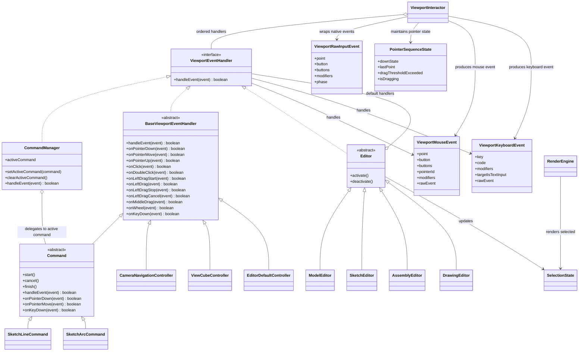

# 视口事件系统架构重构草案

状态：草案，待继续讨论修改。

本文记录当前对视口事件系统重构方向的阶段性共识。当前内容不是最终设计，也不作为立即编码依据；后续还需要继续确认命名、事件优先级和具体实施步骤。

## 背景

当前草图命令、相机导航、选择、ViewCube 等交互都需要处理视口输入事件。现有实现里，事件分发、命令处理、相机导航回退等逻辑混在一起，导致“命令未处理的事件应该继续交给下一个处理者”这类规则不够清晰。

典型问题是：进入草图绘制命令后，如果用户按下鼠标中键想平移视图，当前命令不应该继续更新草图预览或基准面；中键拖拽应该被相机导航接管。

## 当前核心设计

这版设计先确认核心类名、包职责、依赖关系和事件语义规则，不展开完整环境切换和事务方案。

核心原则：

1. 事件监听和事件处理分离。
2. `ViewportInteractor` 负责接收原始输入事件，并先打包成内部原始输入事件。
3. `ViewportInteractor` 维护 pointer 连续状态，把原始输入事件加工成面向交互的语义事件。
4. `ViewportInteractor` 统一调用分发方法，把交互事件交给具体处理者。
5. 所有能处理事件的对象都面向 `ViewportEventHandler` 接口。
6. `CommandManager` 只实现接口，不继承事件控制基类。
7. `CommandManager` 的职责是管理当前命令，并把事件交给当前命令。
8. `BaseViewportEventHandler` 是事件处理接口的默认空实现基类，不负责解释或转换事件；事件语义识别由 `ViewportInteractor` 完成。
9. 具体 `Command` 继承 `BaseViewportEventHandler`，只重写自己关心的事件回调。
10. 相机等基础交互控制器也可以继承 `BaseViewportEventHandler`。
11. ViewCube 纳入统一事件系统，由 `ViewCubeController` 作为普通事件处理者参与分发。
12. 选择、高亮这类能力不作为顶层事件 Controller 抽象，而是作为状态或服务由当前 `Editor` 环境下的默认交互更新。
13. 业务 Controller 只处理 `ViewportMouseEvent` 或 `ViewportKeyboardEvent`，不直接处理原始 DOM 事件或 `ViewportRawInputEvent`。
14. `pointer move` 只表示无按键移动；按键按下后的移动必须解释成 drag 系列事件。
15. 第一阶段直接替换当前混杂的事件分发实现，不保留旧事件链作为并行过渡层。

## 包职责与第一阶段范围

### `@occt-draw/platform`

`platform` 承载通用输入事件基础设施。

第一阶段新增或重构：

- `ViewportRawInputEvent`
- `ViewportMouseEvent`
- `ViewportKeyboardEvent`
- `PointerSequenceState`
- `ViewportEventHandler`
- `BaseViewportEventHandler`
- `ViewportInteractor`

原因：

- 这些类型和类只描述通用视口输入语义，不依赖 CAD 文档、草图命令、ViewCube 业务或编辑器状态。
- 当前 `ViewportInput`、`ViewportInputHandler`、`CommandManager` 已经在 `platform`，说明该包当前已经承载跨编辑器可复用的输入和命令基础能力。
- `editor` 已经依赖 `platform`，把底层事件基础设施放在 `platform` 不需要新增包依赖。

`platform` 不承载具体业务 Controller。它不应该 import `@occt-draw/editor`，也不应该知道草图命令、ViewCube 点击含义、相机导航策略或选择规则。

### `@occt-draw/editor`

`editor` 承载 CAD 编辑器里的具体事件处理者。

第一阶段新增或重构：

- `CommandManager` 对活动命令的事件转发方式。
- `Command` / `CadCommand` 对 `ViewportMouseEvent` 和 `ViewportKeyboardEvent` 的处理方式。
- `CameraNavigationController`。
- `ViewCubeController`。
- `EditorDefaultController`。
- 当前 `EditorViewportRuntime` 中混在一起的命令分发、视口输入和渲染生命周期逻辑。
- `Application` 作为 CAD 编辑器应用入口，持有 `CommandManager`，并负责初始化文档、命令系统和视口运行时。

原因：

- 相机导航需要当前编辑器状态、渲染图、显示边界和深度采样。
- ViewCube 点击含义依赖当前相机、overlay 命中测试和标准视图切换。
- 默认选择、高亮、基准面选择等规则依赖当前编辑环境。
- 这些能力都属于 CAD 编辑器业务，不应该下沉到 `platform`。

### 第一阶段暂不做

第一阶段不展开完整 `ModelEditor`、`SketchEditor`、`AssemblyEditor`、`DrawingEditor` 环境层。

第一阶段先只引入一个 `EditorDefaultController`，作为当前编辑环境默认交互入口。后续环境差异明确后，再拆成更具体的 `ModelDefaultController`、`SketchDefaultController`、`DrawingDefaultController`。

第一阶段不新增独立 `HighlightState`。当前先沿用现有选择/预选/高亮状态结构，只调整事件来源和职责边界。

第一阶段不拆分 `SelectCommand` 的业务职责。`SelectCommand` 需要迁移到新事件类型，但是否把选择、预选、顶点拖拽拆到默认 Controller，留到后续选择系统重构再讨论。

## 核心类图



## 类职责

### ViewportRawInputEvent

原始输入事件。

它是浏览器原生事件进入系统后的第一层封装，只负责把 DOM 事件整理成项目内部统一格式。

它表达的是“刚刚发生了一个输入事件”，例如：

- pointer down
- pointer move
- pointer up
- wheel
- key down
- context menu

这一层不判断业务含义，也不判断是不是拖拽，只保留统一坐标、按键、修饰键、pointerId、buttons、原生事件引用等基础信息。

### PointerSequenceState

pointer 连续状态。

它记录一次 pointer 操作从按下到释放之间的状态。

它需要回答这些问题：

- 当前是否有 pointer 按下。
- 按下位置在哪里。
- 按下按钮是什么。
- 当前 buttons 是什么。
- 上一次移动位置在哪里。
- 当前移动是否超过拖拽阈值。
- 当前是否已经进入拖拽。

它属于 `ViewportInteractor` 的内部状态。当前阶段先不单独设计成对外 Controller。

它只用于把原始输入事件解释成业务语义事件，不用于记录哪个 Controller 消费了事件，也不用于保存事件归属者。

### ViewportMouseEvent 与 ViewportKeyboardEvent

业务交互事件。

它是给 `ViewportEventHandler` 和具体 Controller 使用的事件，不是浏览器原生事件的直接暴露。

第一版只保留两类业务事件对象：

- `ViewportMouseEvent`
- `ViewportKeyboardEvent`

事件对象只保留通用字段，并保留原始事件引用。

`ViewportMouseEvent` 包含：

- `rawEvent`
- `point`
- `clientPoint`
- `button`
- `buttons`
- `pointerId`，仅 pointer 事件需要
- `pointerType`，仅 pointer 事件需要
- `deltaX`、`deltaY`、`deltaMode`，仅 wheel 事件需要
- `modifiers`

`ViewportKeyboardEvent` 包含：

- `rawEvent`
- `key`
- `code`
- `modifiers`
- `targetIsTextInput`

业务语义不通过事件对象上的 `kind` 字段区分，而通过回调方法名区分。

例如：

- `onPointerDown(event)`
- `onPointerMove(event)`
- `onClick(event)`
- `onDoubleClick(event)`
- `onLeftDragStart(event)`
- `onLeftDrag(event)`
- `onLeftDragStop(event)`
- `onMiddleDrag(event)`
- `onRightDrag(event)`
- `onWheel(event)`
- `onKeyDown(event)`

这样具体命令和 Controller 不需要在业务代码里继续判断原始事件类型、原始阶段或按钮组合来识别业务动作。

原生 `pointercancel` 不直接作为业务事件对象暴露。`ViewportInteractor` 内部处理它，并在需要时调用语义化的 `onLeftDragCancel`、`onMiddleDragCancel` 或 `onRightDragCancel`。

暂不在第一版中设计长按、hover enter / hover leave、key up、多指手势等事件。后续功能需要时再补充。

Controller 应该处理这一层事件，而不是直接处理浏览器原生事件，也不是直接处理只有一层包装的原始事件。

### 交互事件语义规则

`ViewportMouseEvent` 和 `ViewportKeyboardEvent` 是业务 Controller 唯一应该处理的视口输入事件。

原始 DOM 事件和 `ViewportRawInputEvent` 只允许 `ViewportInteractor` 使用，具体 Command、Camera、Editor 默认交互、ViewCube 不直接处理原始 pointer 事件。

`pointer move` 在进入业务 Controller 前必须被重新解释：

1. 如果当前没有任何 pointer button 按下，生成 `pointer move`。
2. 如果当前有 pointer button 按下，并且移动超过拖拽阈值，生成 `drag start` 和后续 `drag`。
3. 如果当前已经进入拖拽，pointer 释放时生成 `drag stop`。
4. 如果当前已经进入拖拽，原生 pointer 被取消时生成 `drag cancel`。
5. drag 系列事件必须保留触发拖拽的按钮类型，例如 left、middle、right。
6. 拖拽过程中不再额外向业务 Controller 分发普通 `pointer move`。

因此：

- 鼠标无按键移动是 `pointer move`。
- 左键按下后移动是 `left drag`。
- 中键按下后移动是 `middle drag`。
- 右键按下后移动是 `right drag`。

例如草图画线命令可以使用 `onPointerMove` 更新 hover 状态下的预览线、snap 点、动态输入和光标坐标；也可以使用 `onLeftDrag` 支持按住左键拖拽画线。

但中键拖拽会被解释成 `middle drag`，交给相机导航处理，不会继续触发草图命令的 `onPointerMove`。

拖拽阈值属于输入语义识别，应由 `ViewportInteractor` 统一处理。具体命令不再各自定义“从 pointer move 识别拖拽”的屏幕像素阈值。

具体命令仍然可以保留业务有效性判断。例如线段过短不创建、矩形边长小于几何容差不提交，这类判断不是事件识别阈值，而是建模规则。

### ViewportEventHandler

事件处理接口。

所有能参与事件分发的对象都实现这个接口。它接收的是 `ViewportInteractor` 生成的 `ViewportEvent`，不直接接收浏览器原生事件。

```ts
interface ViewportEventHandler {
    handleEvent(event: ViewportEvent): boolean;
}
```

返回值含义：

- `true`：事件已被消费，后续处理者不再收到该事件。
- `false`：当前处理者不处理该事件，事件继续交给后续处理者。

### BaseViewportEventHandler

默认事件处理基类。

它不是事件解释器，不负责把事件继续转换成其他业务事件。事件解释和语义识别由 `ViewportInteractor` 完成。

职责：

- 实现 `ViewportEventHandler.handleEvent` 的默认展开逻辑。
- 默认所有回调都返回 `false`，表示不处理该事件。
- 让子类只重写自己关心的回调，避免每个 Controller 或 Command 重复实现空方法。

这样具体命令和控制器不用每个都重复解析内部事件，也不用反复判断原始事件类型、原始阶段或按钮组合。

`onPointerMove` 只表示无按键移动，不用于处理拖拽。拖拽行为必须走 `onLeftDrag`、`onMiddleDrag`、`onRightDrag` 以及对应的 start / stop / cancel 回调。

### CommandManager

命令管理器。

它只实现 `ViewportEventHandler`，不继承 `BaseViewportEventHandler`。

职责：

- 管理当前活动命令。
- 接收事件。
- 如果有当前命令，就把事件交给当前命令。
- 如果没有当前命令，或者当前命令不处理事件，就返回 `false`。

示意：

```ts
class CommandManager implements ViewportEventHandler {
    handleEvent(event: ViewportEvent): boolean {
        if (!this.activeCommand) return false;
        return this.activeCommand.handleEvent(event);
    }
}
```

### Command

命令基类。

它继承 `BaseViewportEventHandler`，表达一次具体业务命令，例如画直线、画圆弧、画矩形。

职责：

- 提供 `start`、`cancel`、`finish` 等命令生命周期。
- 通过 `onPointerDown`、`onClick`、`onLeftDrag`、`onPointerMove`、`onWheel`、`onKeyDown` 等回调处理和自身业务相关的输入。
- 具体命令只重写自己关心的事件。

具体命令不应该把所有 pointer 输入都当成自己的业务输入。

例如草图绘制命令通常处理：

- `onPointerDown`
- `onClick`
- `onLeftDrag`
- `onPointerMove`
- `onKeyDown`

草图绘制命令默认不处理中键拖拽、右键拖拽和滚轮缩放。未被命令消费的事件应继续交给后续 Controller，例如 `CameraNavigationController`。

### CameraNavigationController

相机导航控制器。

职责：

- 处理平移、旋转、缩放。
- 可以继承 `BaseViewportEventHandler`。
- 中键拖拽、右键拖拽、滚轮缩放等基础视图操作应在这里处理。
- 如果导航过程需要连续状态，例如当前 pointerId、拖拽起点、当前导航模式，应由 `CameraNavigationController` 自己维护。

### ViewCubeController

ViewCube 交互控制器。

职责：

- 处理 ViewCube 的命中测试、hover 和视图切换。
- 作为普通事件处理者纳入统一事件系统。
- 可以继承 `BaseViewportEventHandler`。
- 不再作为 runtime 或 `ViewportInteractor` 里的特殊分支单独处理。
- 如果 ViewCube 点击或拖动需要连续状态，例如当前 pointerId、按下目标、点击距离阈值，应由 `ViewCubeController` 自己维护。

ViewCube 是屏幕 overlay 控件，当前确认它的默认处理顺序最高。

### EditorDefaultController

当前编辑环境的默认交互控制器。

第一阶段先只引入 `EditorDefaultController`，不展开完整 `ModelEditor`、`SketchEditor`、`AssemblyEditor`、`DrawingEditor` 体系。

职责：

- 承载当前默认交互规则，例如 hover、预选、点选、基准面选择等。
- 根据 `ViewportMouseEvent` 或 `ViewportKeyboardEvent` 更新当前 `SelectionState` 或相关编辑器状态。
- 在后续环境层明确后，再拆分为具体环境下的默认 Controller。

### Editor

环境级默认事件处理者。

`Editor` 表示当前 CAD 工作环境，也是当前环境默认交互的入口。它不是普通业务命令，也不是一个单独的选择控制器。

它的职责是：

- 表示当前工作环境，例如建模、草图、装配、工程图。
- 决定当前环境下启用哪些默认 Controller。
- 决定这些默认 Controller 的处理顺序和生命周期。
- 承载当前环境下的默认交互规则，例如 hover、预选、点选、框选、基准面选择等。

`Editor` 可以直接实现简单默认交互，也可以把事件委托给环境内部的默认 Controller。

后续可以继续拆分为：

- `ModelEditor` 可以绑定 `ModelDefaultController`。
- `SketchEditor` 可以绑定 `SketchDefaultController`。
- `DrawingEditor` 可以绑定 `DrawingDefaultController`。

这些默认 Controller 可以继承 `BaseViewportEventHandler`，也可以只实现 `ViewportEventHandler`。

暂定环境包括：

- `ModelEditor`
- `SketchEditor`
- `AssemblyEditor`
- `DrawingEditor`

当前不在第一阶段实现这些环境的完整职责。草图、特征、装配、出图之间的模块边界，以及草图编辑会话如何合并成一次可撤销事务，需要后续单独设计。

### Selection 与 Highlight

选择和高亮不是顶层事件 Controller。

它们更适合作为状态或服务存在：

- `SelectionState` 记录当前选中了什么。
- 当前第一阶段先沿用现有状态结构表达预选、高亮或 hover 命中了什么。
- 当前 `EditorDefaultController` 负责根据输入事件更新这些状态。
- 渲染层根据当前选择/预选/高亮状态决定最终显示效果。

这样可以避免把事件解释、选择数据和渲染表现混在一个 `SelectionController` 里。

不同环境可以有不同的选择规则。例如建模环境可以选择实体、面、边；草图环境可以选择草图点、线、圆弧、约束；工程图环境可以选择视图、标注、图纸元素。这些规则应属于当前 `EditorDefaultController` 或后续更具体的环境默认 Controller，而不是全局固定的 `SelectionController`。

### ViewportInteractor

视口事件监听器。

职责：

- 接收浏览器原生事件或上游输入层生成的原始输入事件，例如 pointer、wheel、keyboard、contextmenu。
- 将原始输入事件打包成内部统一的 `ViewportRawInputEvent`。
- 维护 pointer 连续状态，例如按下位置、按下按钮、上一帧位置、是否超过拖拽阈值、是否正在拖拽。
- 根据原始输入事件和 pointer 连续状态生成 `ViewportMouseEvent` 或 `ViewportKeyboardEvent`。
- 监听并内部消费 `pointercancel` 等原生中断事件。
- 如果原生中断发生时正在拖拽，生成语义化的 `drag cancel` 交给交互处理链。
- 清理对应的 `PointerSequenceState`。
- 统一处理浏览器默认行为抑制。某个处理者消费事件后，`ViewportInteractor` 负责阻止浏览器默认行为。
- 统一处理连续 pointer 事件归属。某个 pointer 操作被视口系统接管后，后续 move/up/cancel 应继续回到当前 canvas，并在结束时释放。
- 统一调用分发方法。
- 管理一组有顺序的 `ViewportEventHandler`。
- 把加工后的交互事件按顺序交给这些处理者。
- 如果某个处理者返回 `true`，停止继续分发。
- 如果处理者都返回 `false`，说明该事件没有被当前视口系统消费。

当前阶段分发逻辑先直接放在 `ViewportInteractor` 内部，不单独拆 `EventDispatchChain` 类。

它的输入处理分为三步：

```txt
原始 DOM 事件 / 上游输入事件
  -> ViewportRawInputEvent
  -> 更新 PointerSequenceState
  -> ViewportMouseEvent / ViewportKeyboardEvent
  -> dispatch 给 ViewportEventHandler
```

因此 `pointerdown`、`pointermove`、`pointerup` 不会被当成三个互不相关的孤立事件。`ViewportInteractor` 会把它们串起来，识别出普通移动、点击、拖拽开始、拖拽中、拖拽结束和拖拽取消。

它不负责具体业务：

- 不画线。
- 不平移相机。
- 不选中对象。
- 不判断 ViewCube 点了哪个面。
- 不管理当前命令。
- 不展开 `onPointerDown`、`onMiddleDrag` 这类业务回调。
- 不记录哪个 Controller 消费了事件。
- 不保存当前事件归属者。
- 不判断 ViewCube、相机、命令谁应该拥有后续业务状态。

`ViewportInteractor` 维护的 pointer 连续状态只用于判断事件语义，不用于判断业务归属。

如果某个 Controller 需要处理连续手势，它应该在自己内部维护状态。

例如：

- `ViewCubeController` 可以记录当前按下的 `pointerId` 和 `targetId`。
- `CameraNavigationController` 可以记录当前导航手势、起始点和 pointerId。
- 草图绘制命令可以记录当前草图起点、拖拽起点和临时预览状态。
- `EditorDefaultController` 可以记录框选、预选等环境级交互状态。

事件是否被消费，只由分发链根据当前回调方法的返回值决定。

当前图里先把它表达为：

```txt
ViewportInteractor o-- ViewportEventHandler : ordered handlers
ViewportInteractor --> ViewportRawInputEvent : wraps native events
ViewportInteractor --> PointerSequenceState : maintains pointer state
ViewportInteractor --> ViewportMouseEvent / ViewportKeyboardEvent : produces interaction events
```

也就是它负责“听到事件、整理事件、发给别人处理”。它不关心后面具体是 `CommandManager`、`Editor` 还是相机，只认 `ViewportEventHandler` 接口。

当前已确认的默认处理顺序：

```txt
ViewportInteractor
  -> ViewCubeController
  -> CommandManager
  -> EditorDefaultController
  -> CameraNavigationController
```

其中选择和高亮的默认交互由当前 `EditorDefaultController` 处理，不作为单独的顶层 `SelectionController` 放入分发链。

## 后续设计边界

以下内容当前只定原则，不在本文继续展开完整方案：

- `ModelEditor`、`SketchEditor`、`AssemblyEditor`、`DrawingEditor` 的完整模块职责。
- 不同 CAD 大模块之间的环境切换、默认 Controller 组合和生命周期。
- 是否需要独立 `HighlightState`。
- 是否需要拆分 `SelectCommand` 的选择、预选和编辑职责。
- 草图编辑会话里的多次操作如何合并成一次可撤销/可恢复事务。该问题需要结合 `DocumentRequest`、`EditDraft`、transaction、undo / redo、`SketchEditSession`、finish sketch、cancel sketch 等底层能力单独设计，本文不定义具体事务方案。

## 后续扩展项

以下事件当前不作为第一版必需能力，后续按功能需要补充：

- 双击。
- 长按。
- hover enter / hover leave。
- key up。
- 多指手势。

## 当前结论

当前阶段先确认以下设计：

- `ViewportInteractor` 负责监听和分发，不负责具体业务。
- `ViewportInteractor` 负责把原生事件先打包成 `ViewportRawInputEvent`。
- `ViewportInteractor` 负责维护 pointer 连续状态，并生成 `ViewportMouseEvent` 或 `ViewportKeyboardEvent`。
- `ViewportInteractor` 当前阶段直接维护 controllers 列表和 dispatch 方法，不单独拆事件分发链类。
- `ViewportInteractor` 不记录哪个 Controller 消费了事件，也不保存当前事件归属者。
- `ViewportInteractor` 统一处理拖拽阈值，把原始 pointer move 转成 drag 系列语义事件。
- `ViewportInteractor` 统一处理浏览器默认行为抑制和连续 pointer 事件归属。
- `pointer move` 只表示无按键移动。
- 按键按下后的移动必须生成 drag 系列事件，不再额外向业务 Controller 暴露普通 `pointer move`。
- drag 系列事件必须区分 left、middle、right。
- 业务 Controller 不直接处理原始 DOM 事件或 `ViewportRawInputEvent`。
- 需要连续交互状态的 Controller 自己维护自己的状态。
- `ViewportEventHandler` 是事件处理的核心接口。
- `ViewportEventHandler` 只暴露 `handleEvent(event)` 单入口。
- `BaseViewportEventHandler` 是 `ViewportEventHandler` 的默认展开基类，不负责事件解释；事件解释由 `ViewportInteractor` 完成。
- `CommandManager` 实现 `ViewportEventHandler`，但不继承 `BaseViewportEventHandler`。
- `CommandManager` 只把 `ViewportEvent` 转交给当前活动命令，不直接实现各类 `onXxx` 回调。
- `Command` 继承 `BaseViewportEventHandler`。
- `CameraNavigationController` 这类基础交互控制器也可以继承 `BaseViewportEventHandler`。
- `ViewCubeController` 纳入统一事件系统，不再作为 runtime 特殊分支。
- 第一阶段先引入 `EditorDefaultController`，用于承载当前默认交互规则。
- 选择、高亮是状态或服务，不作为顶层事件 Controller。
- 第一阶段不新增独立 `HighlightState`。
- 第一阶段不拆分 `SelectCommand` 的业务职责，只迁移到新事件类型。
- `ModelEditor`、`SketchEditor`、`AssemblyEditor`、`DrawingEditor` 当前只确认设计原则，完整职责后续单独设计。
- 当前默认处理顺序为：`ViewCubeController`、`CommandManager`、`EditorDefaultController`、`CameraNavigationController`。
