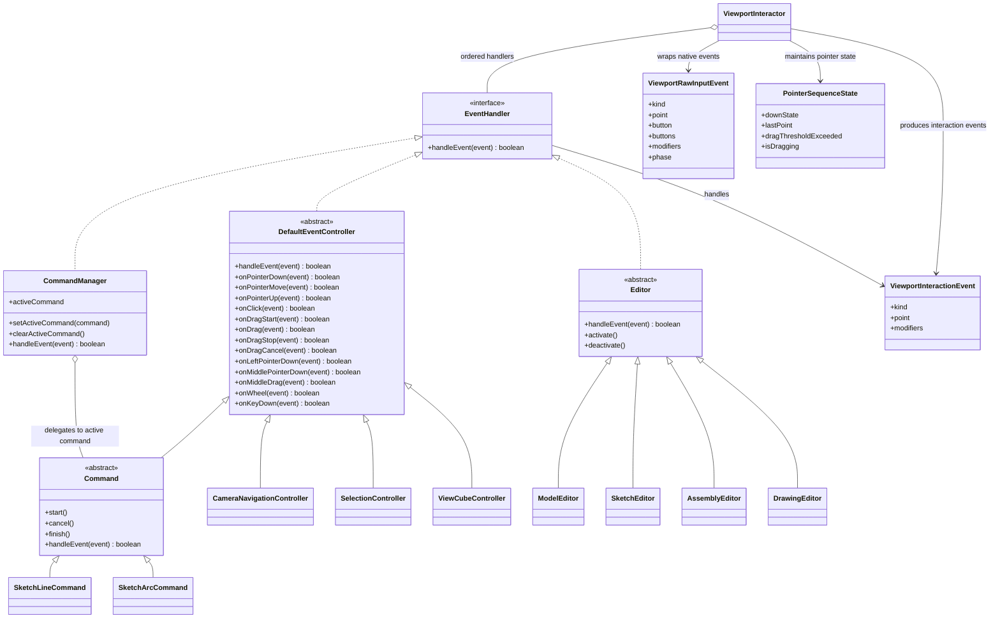

# 视口事件系统架构重构草案

状态：草案，待继续讨论修改。

本文记录当前对视口事件系统重构方向的阶段性共识。当前内容不是最终设计，也不作为立即编码依据；后续还需要继续确认命名、职责边界、事件优先级、手势捕获和包内落点。

## 背景

当前草图命令、相机导航、选择、ViewCube 等交互都需要处理视口输入事件。现有实现里，事件分发、命令处理、相机导航回退等逻辑混在一起，导致“命令未处理的事件应该继续交给下一个处理者”这类规则不够清晰。

典型问题是：进入草图绘制命令后，如果用户按下鼠标中键想平移视图，当前命令不应该继续更新草图预览或基准面；中键拖拽应该被相机导航接管。

## 当前核心设计

这版设计先只确认核心类名和依赖关系，不展开完整事件流。

核心原则：

1. 事件监听和事件处理分离。
2. `ViewportInteractor` 负责监听原生事件，并先打包成内部原始输入事件。
3. `ViewportInteractor` 维护 pointer 连续状态，把原始输入事件加工成面向交互的事件。
4. `ViewportInteractor` 统一调用分发方法，把交互事件交给具体处理者。
5. 所有能处理事件的对象都面向 `EventHandler` 接口。
6. `CommandManager` 只实现接口，不继承事件控制基类。
7. `CommandManager` 的职责是管理当前命令，并把事件交给当前命令。
8. `DefaultEventController` 是默认事件解释器，负责把交互事件展开成更细的业务回调。
9. 具体 `Command` 继承 `DefaultEventController`，只重写自己关心的事件回调。
10. 相机、选择等基础交互控制器也可以继承 `DefaultEventController`。
11. ViewCube 纳入统一事件系统，由 `ViewCubeController` 作为普通事件处理者参与分发。

## 核心类图



## 类职责

### ViewportRawInputEvent

原始输入事件。

它是浏览器原生事件进入系统后的第一层封装，只负责把 DOM 事件整理成项目内部统一格式。

它表达的是“刚刚发生了一个输入事件”，例如：

- pointer down
- pointer move
- pointer up
- wheel
- key down
- context menu

这一层不判断业务含义，也不判断是不是拖拽，只保留统一坐标、按键、修饰键、pointerId、buttons、原生事件引用等基础信息。

### PointerSequenceState

pointer 连续状态。

它记录一次 pointer 操作从按下到释放之间的状态。

它需要回答这些问题：

- 当前是否有 pointer 按下。
- 按下位置在哪里。
- 上一次移动位置在哪里。
- 当前移动是否超过拖拽阈值。
- 当前是否已经进入拖拽。

它属于 `ViewportInteractor` 的内部状态。当前阶段先不单独设计成对外 Controller。

### ViewportInteractionEvent

交互事件。

它是给 `EventHandler` 和具体 Controller 使用的事件，不是原生事件的简单包装，而是经过 `ViewportInteractor` 根据 pointer 状态加工后的事件。

第一版先覆盖当前已实现功能需要的事件：

- pointer down
- pointer move
- pointer up
- click
- drag start
- drag
- drag stop
- drag cancel
- wheel
- key down
- context menu

原生 `pointercancel` 不直接作为业务事件暴露。`ViewportInteractor` 内部处理它，并在需要时生成语义化的 `drag cancel`。

暂不在第一版中设计双击、长按、hover enter / hover leave、key up、多指手势等事件。后续功能需要时再补充。

Controller 应该处理这一层事件，而不是直接处理浏览器原生事件，也不是直接处理只有一层包装的原始事件。

### EventHandler

事件处理接口。

所有能参与事件分发的对象都实现这个接口。它接收的是 `ViewportInteractor` 生成的 `ViewportInteractionEvent`，不直接接收浏览器原生事件。

```ts
interface EventHandler {
    handleEvent(event: ViewportInteractionEvent): boolean;
}
```

返回值含义：

- `true`：事件已被消费，后续处理者不再收到该事件。
- `false`：当前处理者不处理该事件，事件继续交给后续处理者。

### DefaultEventController

默认事件控制器基类。

它是默认事件解释器。

职责：

- 接收 `ViewportInteractionEvent`。
- 在 `handleEvent` 内把交互事件展开成更贴近业务的回调。
- 默认所有回调都返回 `false`，表示不处理该事件。
- 子类只重写自己关心的回调。

第一层展开：

- `onPointerDown`
- `onPointerMove`
- `onPointerUp`
- `onClick`
- `onDragStart`
- `onDrag`
- `onDragStop`
- `onDragCancel`
- `onWheel`
- `onKeyDown`
- `onContextMenu`

第二层展开：

- `onLeftPointerDown`
- `onMiddlePointerDown`
- `onRightPointerDown`
- `onLeftClick`
- `onMiddleClick`
- `onRightClick`
- `onLeftDragStart`
- `onLeftDrag`
- `onLeftDragStop`
- `onLeftDragCancel`
- `onMiddleDragStart`
- `onMiddleDrag`
- `onMiddleDragStop`
- `onMiddleDragCancel`
- `onRightDragStart`
- `onRightDrag`
- `onRightDragStop`
- `onRightDragCancel`

这样具体命令和控制器不用每个都重复解析内部事件，也不用反复写 `event.kind`、`event.phase`、`event.button` 这类判断。

### CommandManager

命令管理器。

它只实现 `EventHandler`，不继承 `DefaultEventController`。

职责：

- 管理当前活动命令。
- 接收事件。
- 如果有当前命令，就把事件交给当前命令。
- 如果没有当前命令，或者当前命令不处理事件，就返回 `false`。

示意：

```ts
class CommandManager implements EventHandler {
    handleEvent(event: ViewportInteractionEvent): boolean {
        if (!this.activeCommand) return false;
        return this.activeCommand.handleEvent(event);
    }
}
```

### Command

命令基类。

它继承 `DefaultEventController`，表达一次具体业务命令，例如画直线、画圆弧、画矩形。

职责：

- 提供 `start`、`cancel`、`finish` 等命令生命周期。
- 通过 `onLeftPointerDown`、`onMiddleDrag`、`onWheel`、`onKeyDown` 等回调处理输入。
- 具体命令只重写自己关心的事件。

### CameraNavigationController

相机导航控制器。

职责：

- 处理平移、旋转、缩放。
- 可以继承 `DefaultEventController`。
- 中键拖拽、右键旋转、滚轮缩放等基础视图操作应在这里处理。

### SelectionController

选择控制器。

职责：

- 处理 hover、预选、点选、框选等选择行为。
- 可以继承 `DefaultEventController`。

### ViewCubeController

ViewCube 交互控制器。

职责：

- 处理 ViewCube 的命中测试、hover 和视图切换。
- 作为普通事件处理者纳入统一事件系统。
- 可以继承 `DefaultEventController`。
- 不再作为 runtime 或 `ViewportInteractor` 里的特殊分支单独处理。

ViewCube 是屏幕 overlay 控件，当前确认它的默认处理顺序最高。

### Editor

环境级默认事件处理者。

当前阶段暂定 `Editor` 也是一个 `EventHandler`。它表示当前 CAD 工作环境下的默认交互控制器，而不是普通业务命令。

它存在的原因是：默认状态下也需要处理一些不属于具体命令的交互，例如：

- hover / 预选高亮。
- 基准面选择。
- 默认选择行为。
- 当前环境下允许哪些命令和 Controller 参与事件处理。

`Editor` 可以直接处理默认事件，也可以把事件委托给环境内部的子 Controller。后续如果默认交互变复杂，可以继续拆出更细的 Controller，例如 `ModelSelectionController`、`SketchSelectionController`、`PreselectionController`。

暂定环境包括：

- `ModelEditor`
- `SketchEditor`
- `AssemblyEditor`
- `DrawingEditor`

当前不强行把这些环境的完整职责一次性定死。草图、特征、装配、出图之间的模块边界，以及草图编辑会话如何合并成一次可撤销事务，需要后续单独设计。

### ViewportInteractor

视口事件监听器。

职责：

- 监听浏览器原生事件，例如 pointer、wheel、keyboard、contextmenu。
- 将原生事件打包成内部统一的 `ViewportRawInputEvent`。
- 维护 pointer 连续状态，例如按下位置、上一帧位置、是否超过拖拽阈值、是否正在拖拽。
- 根据原始输入事件和 pointer 连续状态生成 `ViewportInteractionEvent`。
- 监听并内部消费 `pointercancel` 等原生中断事件。
- 如果原生中断发生时正在拖拽，生成语义化的 `drag cancel` 交给当前交互处理者。
- 清理对应的 `PointerSequenceState`。
- 统一调用分发方法。
- 管理一组有顺序的 `EventHandler`。
- 把加工后的交互事件按顺序交给这些处理者。
- 如果某个处理者返回 `true`，停止继续分发。
- 如果处理者都返回 `false`，说明该事件没有被当前视口系统消费。

当前阶段分发逻辑先直接放在 `ViewportInteractor` 内部，不单独拆 `EventDispatchChain` 类。

它的输入处理分为三步：

```txt
原生 DOM 事件
  -> ViewportRawInputEvent
  -> 更新 PointerSequenceState
  -> ViewportInteractionEvent
  -> dispatch 给 EventHandler
```

因此 `pointerdown`、`pointermove`、`pointerup` 不会被当成三个互不相关的孤立事件。`ViewportInteractor` 会把它们串起来，识别出普通移动、拖拽开始、拖拽中和拖拽结束。

它不负责具体业务：

- 不画线。
- 不平移相机。
- 不选中对象。
- 不判断 ViewCube 点了哪个面。
- 不管理当前命令。
- 不展开 `onLeftPointerDown`、`onMiddleDrag` 这类业务回调。

当前图里先把它表达为：

```txt
ViewportInteractor o-- EventHandler : ordered handlers
ViewportInteractor --> ViewportRawInputEvent : wraps native events
ViewportInteractor --> PointerSequenceState : maintains pointer state
ViewportInteractor --> ViewportInteractionEvent : produces interaction events
```

也就是它负责“听到事件、整理事件、发给别人处理”。它不关心后面具体是 `CommandManager`、相机还是选择，只认 `EventHandler` 接口。

当前已确认的默认处理顺序：

```txt
ViewportInteractor
  -> ViewCubeController
  -> CommandManager
  -> Editor
  -> CameraNavigationController
  -> SelectionController
```

## 后续设计边界

以下内容当前只定原则，不在本文继续展开完整方案：

- `ModelEditor`、`SketchEditor`、`AssemblyEditor`、`DrawingEditor` 的完整模块职责。
- 这些 Editor 的包内落点和跨包边界。
- 不同 CAD 大模块之间的环境切换、默认 Controller 组合和生命周期。
- 草图编辑会话里的多次操作如何合并成一次可撤销/可恢复事务。该问题需要结合 `DocumentRequest`、`EditDraft`、transaction、undo / redo、`SketchEditSession`、finish sketch、cancel sketch 等底层能力单独设计，本文不定义具体事务方案。

## 后续扩展项

以下事件当前不作为第一版必需能力，后续按功能需要补充：

- 双击。
- 长按。
- hover enter / hover leave。
- key up。
- 多指手势。

## 当前结论

当前阶段先确认以下设计：

- `ViewportInteractor` 负责监听和分发，不负责具体业务。
- `ViewportInteractor` 负责把原生事件先打包成 `ViewportRawInputEvent`。
- `ViewportInteractor` 负责维护 pointer 连续状态，并生成 `ViewportInteractionEvent`。
- `ViewportInteractor` 当前阶段直接维护 controllers 列表和 dispatch 方法，不单独拆事件分发链类。
- `EventHandler` 是事件处理的核心接口。
- `DefaultEventController` 是默认事件解释器，负责把交互事件展开成细粒度回调。
- `CommandManager` 实现 `EventHandler`，但不继承 `DefaultEventController`。
- `CommandManager` 只把事件转交给当前活动命令。
- `Command` 继承 `DefaultEventController`。
- `CameraNavigationController`、`SelectionController` 这类基础交互控制器也可以继承 `DefaultEventController`。
- `ViewCubeController` 纳入统一事件系统，不再作为 runtime 特殊分支。
- `Editor` 暂定为环境级默认 `EventHandler`，用于承载不同工作环境的默认交互规则。
- `ModelEditor`、`SketchEditor`、`AssemblyEditor`、`DrawingEditor` 当前只确认设计原则，完整职责和包内落点后续单独设计。
- 当前默认处理顺序为：`ViewCubeController`、`CommandManager`、`Editor`、`CameraNavigationController`、`SelectionController`。
