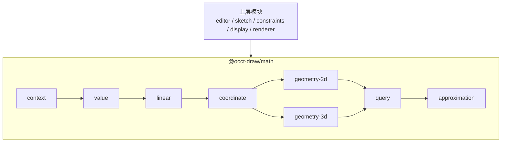

# math 库架构设计

## 总架构图

## 模块和类

### context

- `GeometryContext`
- `Tolerance`
- `UnitSystem`

### value

- `Scalar`
- `Angle`
- `Interval`
- `GeometryResult`

### linear

- `Vec2`
- `Vec3`
- `Vec4`
- `Matrix3`
- `Matrix4`
- `Quaternion`

### coordinate

- `Coord2`
- `Coord3`

### geometry-2d

- `Line2`
- `Circle2`
- `BBox2`
- `Curve2`
- `BoundedCurve2`
- `LineSegment2`
- `Arc2`
- `Ellipse2`
- `Polyline2`
- `Polygon2`
- `Bezier2`
- `BSpline2`
- `Nurbs2`
- `ParameterDomain`
- `CurveParameter`

### geometry-3d

- `Ray3`
- `Line3`
- `LineSegment3`
- `Plane3`
- `Triangle3`
- `Sphere3`
- `BBox3`
- `OBB3`

### query

- `Projection`
- `Intersection`
- `Measurement`
- `Distance`
- `Containment`
- `Classification`
- `Construction`
- `ProjectionResult`
- `IntersectionResult`
- `ClosestPointResult`
- `MeasurementResult`
- `ClassificationResult`

### approximation

- `CurveSampler`：按参数或精度采样曲线点。
- `PolylineApproximation`：把曲线近似为折线。
- `BoundsApproximation`：计算曲线或近似几何的包围盒。
