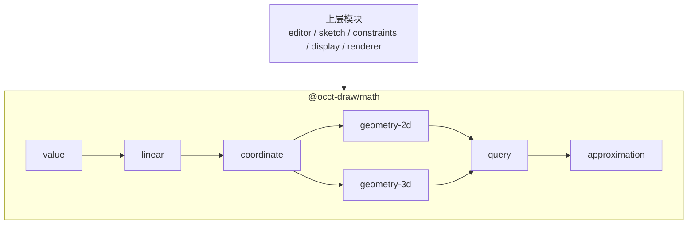

# math 库架构设计

## 总架构图

```mermaid
flowchart TB
    App["上层模块<br/>editor / sketch / constraints / display / renderer"]

    subgraph Math["@occt-draw/math"]
        Value["value"]
        Linear["linear"]
        Coordinate["coordinate"]
        Geometry2D["geometry-2d"]
        Geometry3D["geometry-3d"]
        Query["query"]
        Approximation["approximation"]

        Value --> Linear
        Linear --> Coordinate
        Coordinate --> Geometry2D
        Coordinate --> Geometry3D
        Geometry2D --> Query
        Geometry3D --> Query
        Query --> Approximation
    end

    App --> Math
```

## 模块和类

### value

- `Scalar`
- `Angle`
- `Interval`
- `GeometryResult`：几何计算通用结果状态，用于表达 `success / empty / parallel / coincident / degenerate` 等情况。
- `Tolerance`

### linear

- `Vec2`
- `Vec3`
- `Vec4`
- `Matrix3`：二维齐次矩阵，用于草图平面内平移、旋转、缩放、镜像。
- `Matrix4`：三维齐次矩阵，用于世界空间和渲染链路变换。
- `Quaternion`

### coordinate

- `Coord2`：二维局部坐标系，表达原点和坐标轴，用于草图平面内的局部几何计算。
- `Coord3`：三维局部坐标系，表达原点和三维基向量，用于世界空间中的局部参考系。

### geometry-2d

- `Line2`
- `Circle2`
- `BBox2`
- `Curve2`
- `BoundedCurve2`
- `LineSegment2`
- `Arc2`
- `Ellipse2`
- `EllipticalArc2`
- `Polyline2`
- `Polygon2`
- `Bezier2`
- `BSpline2`
- `Nurbs2`
- `ParameterDomain`：曲线有效参数范围。
- `CurveParameter`：曲线上的参数值。

### geometry-3d

- `Ray3`
- `Line3`
- `LineSegment3`
- `Plane3`：三维平面，包含 `origin / normal / xAxis / yAxis`，负责草图局部坐标与世界坐标转换。
- `Triangle3`
- `Sphere3`
- `BBox3`
- `OBB3`

### query

只放查询和计算，不放几何构造。

- `Projection`
- `Intersection`
- `Measurement`
- `Distance`
- `Containment`
- `Classification`
- `ProjectionResult`
- `IntersectionResult`
- `ClosestPointResult`
- `MeasurementResult`
- `DistanceResult`
- `ClassificationResult`

### approximation

- `CurveSampler`：按参数或精度采样曲线点。
- `PolylineApproximation`：把曲线近似为折线。
- `BoundsApproximation`：计算曲线或近似几何的包围盒。

## 实现优先级

### v1 草图基础

- `Vec2`
- `Vec3`
- `Scalar`
- `Angle`
- `Tolerance`
- `Matrix3`
- `Matrix4`
- `Line2`
- `LineSegment2`
- `Circle2`
- `Arc2`
- `Plane3`
- `BBox2`
- `BBox3`
- `ProjectionResult`
- `IntersectionResult`
- `DistanceResult`
- `ClosestPointResult`
- `ClassificationResult`
- `CurveParameter`
- `ParameterDomain`

### v2 草图增强

- `Ellipse2`
- `EllipticalArc2`
- `Polyline2`
- `Polygon2`
- `CurveSampler`
- `PolylineApproximation`
- `BoundsApproximation`

### future 曲线能力

- `Bezier2`
- `BSpline2`
- `Nurbs2`
