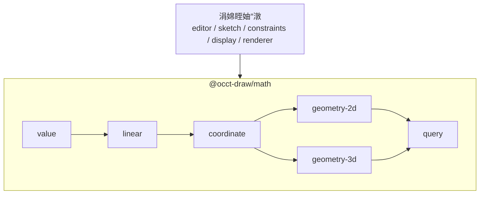

# math 搴撴灦鏋勮璁?

## 鎬绘灦鏋勫浘

```mermaid
flowchart TB
    App["涓婂眰妯″潡<br/>editor / sketch / constraints / display / renderer"]

    subgraph Math["@occt-draw/math"]
        Value["value"]
        Linear["linear"]
        Coordinate["coordinate"]
        Geometry2D["geometry-2d"]
        Geometry3D["geometry-3d"]
        Query["query"]

        Value --> Linear
        Linear --> Coordinate
        Coordinate --> Geometry2D
        Coordinate --> Geometry3D
        Geometry2D --> Query
        Geometry3D --> Query
    end

    App --> Math
```

## 妯″潡鍜岀被

### value

- `Scalar`
- `Angle`
- `Interval`
- `GeometryResult`锛氬嚑浣曡绠楅€氱敤缁撴灉鐘舵€侊紝鐢ㄤ簬琛ㄨ揪 `success / empty / parallel / coincident / degenerate` 绛夋儏鍐点€?- `Tolerance`

### linear

- `Vec2`
- `Vec3`
- `Vec4`
- `Matrix3`锛氫簩缁撮綈娆＄煩闃碉紝鐢ㄤ簬鑽夊浘骞抽潰鍐呭钩绉汇€佹棆杞€佺缉鏀俱€侀暅鍍忋€?- `Matrix4`锛氫笁缁撮綈娆＄煩闃碉紝鐢ㄤ簬涓栫晫绌洪棿鍜屾覆鏌撻摼璺彉鎹€?- `Quaternion`

### coordinate

- `Coord2`锛氫簩缁村眬閮ㄥ潗鏍囩郴锛岃〃杈惧師鐐瑰拰鍧愭爣杞达紝鐢ㄤ簬鑽夊浘骞抽潰鍐呯殑灞€閮ㄥ嚑浣曡绠椼€?- `Coord3`锛氫笁缁村眬閮ㄥ潗鏍囩郴锛岃〃杈惧師鐐瑰拰涓夌淮鍩哄悜閲忥紝鐢ㄤ簬涓栫晫绌洪棿涓殑灞€閮ㄥ弬鑰冪郴銆?

### geometry-2d

- `Line2`
- `Circle2`
- `BBox2`
- `Curve2`
- `BoundedCurve2`
- `LineSegment2`
- `Arc2`
- `Ellipse2`
- `EllipticalArc2`
- `Polyline2`
- `Polygon2`
- `Bezier2`
- `BSpline2`
- `Nurbs2`
- `ParameterDomain`锛氭洸绾挎湁鏁堝弬鏁拌寖鍥淬€?- `CurveParameter`锛氭洸绾夸笂鐨勫弬鏁板€笺€?

### geometry-3d

- `Ray3`
- `Line3`
- `LineSegment3`
- `Plane3`锛氫笁缁村钩闈紝鍖呭惈 `origin / normal / xAxis / yAxis`锛岃礋璐ｈ崏鍥惧眬閮ㄥ潗鏍囦笌涓栫晫鍧愭爣杞崲銆?- `Triangle3`
- `Sphere3`
- `BBox3`
- `OBB3`

### query

鍙斁鏌ヨ鍜岃绠楋紝涓嶆斁鍑犱綍鏋勯€犮€?

- `Projection`
- `Intersection`
- `Measurement`
- `Distance`
- `Containment`
- `Classification`
- `ProjectionResult`
- `IntersectionResult`
- `ClosestPointResult`
- `MeasurementResult`
- `DistanceResult`
- `ClassificationResult`

## 瀹炵幇浼樺厛绾?

### v1 鑽夊浘鍩虹

- `Vec2`
- `Vec3`
- `Scalar`
- `Angle`
- `Tolerance`
- `Matrix3`
- `Matrix4`
- `Line2`
- `LineSegment2`
- `Circle2`
- `Arc2`
- `Plane3`
- `BBox2`
- `BBox3`
- `ProjectionResult`
- `IntersectionResult`
- `DistanceResult`
- `ClosestPointResult`
- `ClassificationResult`
- `CurveParameter`
- `ParameterDomain`

### v2 鑽夊浘澧炲己

- `Ellipse2`
- `EllipticalArc2`
- `Polyline2`
- `Polygon2`

### future 鏇茬嚎鑳藉姏

- `Bezier2`
- `BSpline2`
- `Nurbs2`
