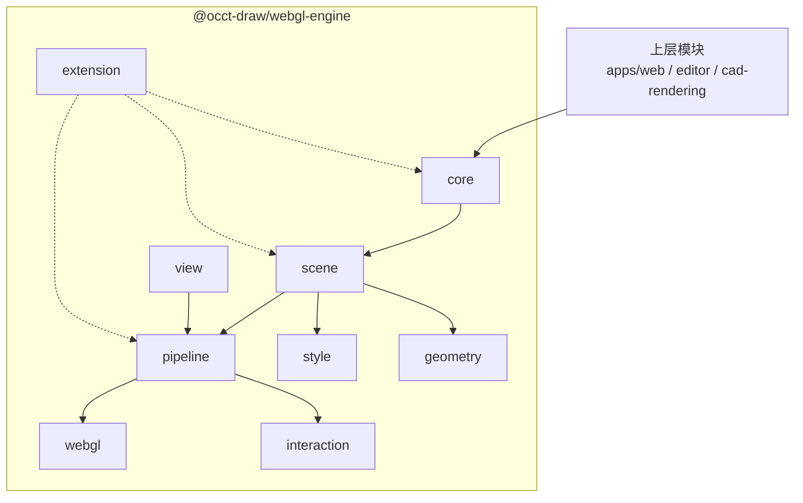

# WebGL 引擎架构设计

## 总架构图

## 模块和类

### core

引擎对象和生命周期，不放 WebGL 细节，也不放 CAD 业务模型。

- `RenderEngine`：引擎入口，持有渲染图、视口、管线、扩展和后端。
- `RenderGraph`：视口渲染图，管理 layer 和 object。
- `RenderLayer`：渲染层，用于模型、草图、辅助对象、overlay、widget 等分层。
- `RenderObject`：场景对象基类，包含 `id / name / visible / transform / bounds / pickable / metadata`。
- `RenderGroup`：场景对象分组。
- `RenderDirtyFlags`：表达 object、geometry、style、bounds 等局部更新状态。
- `RenderCapabilities`：运行时能力。
- `RenderStats`：帧统计信息。

### scene

CAD 视口渲染 primitive。这里不表达 `CadDocument / Sketch / Feature`，只表达引擎可渲染对象。

- `FaceSet`：面片集合。
- `EdgeSet`：边线集合。
- `PointSet`：点集合。
- `CurveSet`：曲线近似集合。
- `TextLabelSet`：文字集合。
- `MarkerSet`：固定像素 marker 集合。
- `OverlayObject`：overlay 对象。
- `ViewportWidget`：视口控件对象。

### geometry

GPU 上传前的几何数据结构。geometry 只负责数据，不负责样式和业务语义。

- `Geometry`
- `FaceGeometry`
- `EdgeGeometry`
- `PointGeometry`
- `CurveGeometry`
- `TextGeometry`
- `MarkerGeometry`
- `VertexBufferLayout`
- `GeometryBuffer`
- `IndexBuffer`
- `GeometryBounds`

### style

CAD 视口样式。这里不以通用 PBR material 为核心，而是表达工程视口需要的显示状态。

- `RenderStyle`
- `FaceStyle`
- `EdgeStyle`
- `PointStyle`
- `CurveStyle`
- `TextStyle`
- `MarkerStyle`
- `HighlightStyle`
- `HiddenLineStyle`
- `XRayStyle`
- `StyleResolver`

### view

视口和相机。该层负责屏幕尺寸、设备像素比、工程视图相机、fit 和 depth 反算。

- `RenderViewport`
- `ViewportSize`
- `ViewportRect`
- `Camera`
- `OrthographicCamera`
- `PerspectiveCamera`
- `StandardViewFrame`
- `CameraFitter`
- `CameraClipping`
- `CameraRay`
- `DepthUnprojector`

### pipeline

渲染管线和 pass 系统。pass 是 picking、depth sampling、highlight、overlay 等能力的主要扩展点。

- `RenderPipeline`
- `RenderPass`
- `PassRegistry`
- `RenderQueue`
- `DrawCommand`
- `ColorPass`
- `DepthPrepass`
- `PickIdPass`
- `NavigationDepthPass`
- `HighlightPass`
- `OverlayPass`
- `CompositePass`

### interaction

渲染相关交互数据。这里返回通用命中结果，上层再解释成 CAD 选择语义。

- `PickKey`
- `PickResult`
- `HitTester`
- `PickBuffer`
- `PickBufferReader`
- `NavigationDepthSampler`
- `SelectionHighlight`
- `HoverHighlight`
- `PreselectionHighlight`

### webgl

WebGL2 后端。该层负责 shader、buffer、texture、framebuffer 和 GPU 资源生命周期。

- `WebGLRenderer`
- `WebGLDevice`
- `ShaderProgram`
- `ShaderLibrary`
- `BufferManager`
- `TextureManager`
- `FramebufferManager`
- `VertexArrayManager`
- `ResourceRegistry`
- `ResourceCache`

### extension

引擎扩展机制。扩展由 `webgl-engine` 包提供，按需安装到 `RenderEngine`。

- `RenderExtension`
- `LabelsExtension`
- `PickingExtension`
- `NavigationDepthExtension`
- `ViewCubeExtension`
- `CadHelpersExtension`
- `HiddenLineExtension`
- `XRayExtension`

## 实现优先级

### v1 引擎骨架

- `RenderEngine`
- `RenderGraph`
- `RenderLayer`
- `RenderObject`
- `RenderGroup`
- `RenderViewport`
- `OrthographicCamera`
- `CameraFitter`
- `FaceSet`
- `EdgeSet`
- `PointSet`
- `MarkerSet`
- `FaceGeometry`
- `EdgeGeometry`
- `PointGeometry`
- `FaceStyle`
- `EdgeStyle`
- `PointStyle`
- `MarkerStyle`
- `RenderPipeline`
- `RenderPass`
- `ColorPass`
- `WebGLRenderer`
- `ResourceRegistry`

### v2 CAD 视口基础

- `TextLabelSet`
- `LabelsExtension`
- `PickKey`
- `PickResult`
- `PickingExtension`
- `NavigationDepthExtension`
- `HighlightPass`
- `SelectionHighlight`
- `HoverHighlight`
- `PreselectionHighlight`
- `ViewCubeExtension`
- `CadHelpersExtension`
- layer depth policy
- incremental dirty update

### v3 大模型和高级显示

- indexed geometry
- geometry range update
- instancing
- render queue sorting
- hidden-line pass
- xray pass
- section clipping
- silhouette edge
- multi viewport
- offscreen snapshot
- render stats panel

### future 后端和质量增强

- WebGPU backend
- worker geometry preparation
- high quality text shaping
- screen-space anti-aliasing
- large assembly streaming
- progressive rendering
