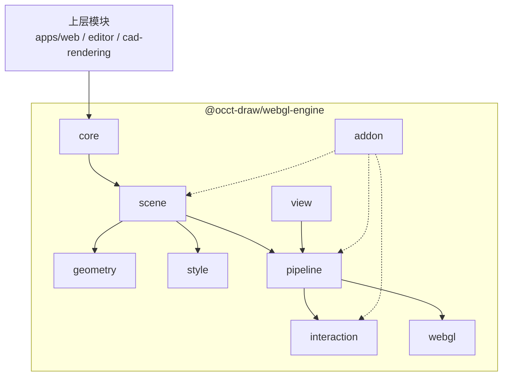

# WebGL 引擎架构设计

## 总架构图



## 当前分层一览

主链路：

```txt
应用层
  -> RenderEngine
  -> RenderGraph
  -> RenderPipeline
  -> RenderBackend
  -> WebGLRenderer
  -> WebGL2
```

- 应用层：只从 `@occt-draw/webgl-engine` 包入口使用公开类，不 deep import 内部模块。
- `RenderEngine`：公开入口，绑定 canvas，管理 graph、highlight、viewport，并调度每一帧。
- `RenderGraph`：场景结构，管理 layer 和 object，不理解 GPU 资源。
- `RenderPipeline`：渲染阶段顺序，执行 color、highlight、overlay 等 pass，不直接访问 WebGL。
- `RenderBackend`：内部后端接口，承接 pass 发出的绘制请求。
- `WebGLRenderer`：内部 WebGL2 后端实现，管理 shader、buffer、label atlas、WebGL state 和资源释放。
- `RenderQueue / WebGLImmediateRenderer / ResourceRegistry`：内部实现细节，应用层和 pass 不直接依赖。

## 当前稳定公开 API

### core

引擎对象和生命周期，不放 WebGL 细节，也不放 CAD 业务模型。

- `RenderEngine`：引擎入口，持有渲染图、视口、管线和后端。
- `RenderGraph`：视口渲染图，管理 layer 和 object。
- `RenderLayer`：渲染层，用于模型、草图、辅助对象、overlay、widget 等分层。
- `RenderObject`：场景对象基类，包含 `id / name / visible / transform / bounds / pickable / metadata`。
- `RenderGroup`：场景对象分组。
- `RenderDirtyFlags`：表达 object、geometry、style、bounds 等局部更新状态。

### scene

CAD 视口渲染 primitive。这里不表达 `CadDocument / Sketch / Feature`，只表达引擎可渲染对象。

- `FaceSet`：面片集合。
- `EdgeSet`：边线集合。
- `PointSet`：点集合。
- `TextLabelSet`：文字集合。
- `MarkerSet`：固定像素 marker 集合。
- `ViewportWidget`：视口控件对象基类。

### geometry

GPU 上传前的几何数据结构。当前 geometry 只负责数据，不负责样式和业务语义。

- `FaceGeometry`
- `EdgeGeometry`
- `PointGeometry`
- `TextGeometry`
- `MarkerGeometry`
- `GeometryBounds`

### style

CAD 视口样式。这里不以通用 PBR material 为核心，而是表达工程视口需要的显示状态。

- `FaceStyle`
- `EdgeStyle`
- `PointStyle`
- `TextStyle`
- `MarkerStyle`

### view

当前公开 view API 以 `CameraState` 和视图工具函数表达，不公开独立相机类。

- `ViewportSize`
- `CameraState`
- `StandardCameraFrame`
- `createStandardCameraState`
- `createCameraStateFromFrame`
- `fitCameraToBounds`
- `frameCameraClippingToBounds`
- `screenPointToWorldRay`
- `screenPointToWorldOnViewPlane`
- `canvasDepthToWorld`

### pipeline

渲染管线和 pass 系统。pass 是 picking、depth sampling、highlight、overlay 等能力的主要扩展点。

- `RenderPipeline`
- `RenderPass`：渲染管线中的一个执行阶段，例如颜色绘制、overlay、picking 或 depth sampling；不承载 CAD 业务语义。
- `ColorPass`
- `HighlightPass`
- `OverlayPass`

### interaction

渲染相关交互数据。这里返回通用命中结果，上层再解释成 CAD 选择语义。

- `PickKey`
- `PickResult`
- `RenderObjectPicker`
- `NavigationDepthSampler`
- `SelectionHighlight`
- `HoverHighlight`
- `PreselectionHighlight`

### addon

可选能力类。addon 类由引擎包导出，应用层决定是否实例化、加入哪个 layer，以及如何处理事件。

- `ViewCube`：视口方向控件。
- `ViewportWidget`：视口控件对象基类。

## 当前内部实现

这些能力是引擎内部核心，不从主包入口公开，上层不能 deep import。

- `RenderQueue / RenderQueueBuilder / DrawCommand`：已作为内部模块落地，把 `RenderGraph` 转换成本帧绘制计划。
- `RenderBackend`：已作为内部后端接口落地，隔离 `RenderEngine` 和具体图形 API。
- `WebGLRenderer`：已作为当前 WebGL2 后端实现落地，管理 context、shader、buffer、label atlas 和 GPU 资源。
- `ResourceRegistry`：已作为 WebGL 后端内部资源生命周期管理模块落地，集中释放 program、buffer、VAO、label atlas、buffer cache 和 navigation depth 资源。
- backend immediate draw：已作为内部能力落地，用于 highlight、overlay、widget 等非 graph queue 的临时绘制。
- `WebGLImmediateRenderer`：已作为内部 helper 落地，承接 immediate primitive / label 绘制和对应 WebGL state。
- `RenderMaterial / RenderState / ShaderVariantKey`：已作为内部 style-to-backend 语义落地，由公开 `Style` 解析生成。
- `RenderableObject`：已作为可扩展渲染对象基类落地，内置 face、edge、point、marker、label 和外部自定义图元走同一套对象协议。
- `GeometryBuffer / GeometryBufferBuilder / VertexAttributeLayout / BufferIndex / dirty range`：已作为 geometry-to-GPU buffer 基础落地，统一维护 position attribute layout、bounds 和 vertex count。
- `RenderBufferCache`：WebGL buffer 缓存，避免 clean geometry 重复上传。
- `RenderPipelineResources`：已收窄为迁移期内部过渡上下文，仅保留 backend 和 label atlas glyphs，不是使用者 API。
- shader、label atlas、VAO、WebGL state guard、legacy adapter：只属于 WebGL 后端或迁移层。

## 目标架构和后续规划

这些类是专业 CAD 渲染引擎目标，不表示当前已全部公开或完成。

- backend：`RenderBackend / WebGLRenderer / ResourceRegistry`
- queue：`RenderQueue / DrawCommand / RenderQueueBuilder`
- material：`RenderMaterial / RenderState / ShaderVariantKey`
- viewport：`RenderViewport / Camera / OrthographicCamera / PerspectiveCamera`
- geometry：`GeometryBuffer / VertexBufferLayout / IndexBuffer / dirty range`
- pass：`DepthPrepass / PickIdPass / NavigationDepthPass / HiddenLinePass / XRayPass / CompositePass`
- addon：`AxesHelper / GridHelper / PlaneHelper / OriginHelper / BoundsHelper / SectionPlaneWidget`

## 导出约定

- 包入口优先导出类。
- 不导出散落流程函数。
- 公共 API 只从包入口导出，禁止上层 deep import 内部模块。
- 模块内 helper 默认保持私有。
- 可复用算法优先放入 `@occt-draw/math`。
- 引擎包只保留渲染对象、渲染管线、交互缓冲和 WebGL 资源管理相关逻辑。
- ViewCube、helper、overlay、label 等能力优先以类导出，应用层决定是否实例化和如何接入。

## 公共 API 目标

- `webgl-engine` 是可复用引擎包，不只服务当前 CAD 产品。
- 包入口只暴露少量稳定入口类、渲染对象类、pass 类和 addon 类。
- API 默认面向组合和扩展，不暴露内部管线细节。
- 新能力优先通过 `RenderObject / RenderPass / ViewportWidget` 扩展。
- 当前产品的业务约定不得进入公共 API。

## 使用者视角

使用者只依赖包入口：

```ts
import {
    EdgeGeometry,
    EdgeSet,
    EdgeStyle,
    FaceGeometry,
    FaceSet,
    FaceStyle,
    RenderEngine,
    RenderGraph,
    RenderLayer,
    ViewCube,
    createStandardCameraState,
} from '@occt-draw/webgl-engine';
```

推荐使用流程：

1. 应用层创建 `RenderEngine`，传入目标 `HTMLCanvasElement`，把这个 canvas 交给引擎绘制。
2. 应用层创建 `RenderGraph`。
3. 应用层创建 `RenderLayer`，例如 scene layer 和 overlay layer。
4. 应用层添加 `FaceSet / EdgeSet / PointSet / MarkerSet / TextLabelSet` 等 render object。
5. 应用层按需创建 `ViewCube` 等 addon，并加入 overlay layer。
6. 应用层调用 `engine.setGraph(graph)`。
7. 视口尺寸变化时调用 `engine.resize(viewportSize)`。
8. 选择状态变化时调用 `engine.setHighlight(highlight)`。
9. 相机变化或数据更新后调用 `engine.render(camera)`。

不推荐使用：

- `createWebglRenderer`：仅保留为 legacy / deprecated facade，新代码使用 `new RenderEngine(canvas)`。
- `packages/webgl-engine/src/**` deep import：上层只能从 `@occt-draw/webgl-engine` 包入口导入。
- `RenderBufferCache / RenderQueue / ResourceRegistry / WebGLRenderer / RenderPipelineResources / shader / label atlas / legacy adapter`：这些是内部实现，不是使用者 API。

`RenderEngine` 是 canvas 渲染入口，不是 scene、object 或 WebGL 后端。使用者创建它之后，只通过 graph、camera、highlight 等输入驱动渲染。

## 核心对象模型

渲染引擎里要画的东西统一表达为 `RenderObject`：

```txt
RenderObject = Geometry + Style + Bounds + DirtyFlags + PickMetadata
```

- `Geometry`：形状数据，例如三角面、线段、点坐标。
- `Style`：显示样式，例如颜色、透明度、点大小。
- `Bounds`：对象包围盒，用于 fit、navigation depth 和视口范围计算。
- `DirtyFlags`：对象、geometry、style、bounds 的局部更新标记。
- `PickMetadata`：pickable、interactionId、metadata 等交互信息。

`FaceSet / EdgeSet / PointSet / MarkerSet / TextLabelSet` 都是 `RenderObject` 子类。这里的 `Set` 表示“一组同类 primitive 的可渲染对象”，不是普通数组。

```txt
FaceSet  = FaceGeometry  + FaceStyle
EdgeSet  = EdgeGeometry  + EdgeStyle
PointSet = PointGeometry + PointStyle
```

- `FaceSet`：一组面片的渲染对象。
- `EdgeSet`：一组线段的渲染对象。
- `PointSet`：一组点的渲染对象。

初始化场景并画点线面的链路：

```txt
RenderEngine
  <- RenderGraph
    <- RenderLayer
      <- FaceSet / EdgeSet / PointSet
```

使用者先创建点线面对象，把它们加入 layer，再把 layer 加入 graph，最后把 graph 交给 `RenderEngine`。`RenderEngine` 不直接持有点线面，只负责调度渲染。

引擎内部会把公开 geometry 转成 GPU 更容易消费的 `GeometryBuffer`：

```txt
RenderObject
  -> Public Geometry
  -> Internal GeometryBuffer
  -> DrawCommand
  -> WebGLRenderer
  -> GPU Buffer
```

使用者不需要直接创建或管理 `GeometryBuffer`。它是引擎内部 GPU-ready buffer 数据，只表达几何数据到 GPU buffer 的结构，用来集中管理 position attribute layout、可选 index buffer、dirty range 和 bounds cache。颜色、透明度、点大小等显示语义不进入 `GeometryBuffer`，而是由 `Style -> RenderMaterial` 解析后交给 backend。

当前 face、edge、point、marker、label 都继承 `RenderableObject`，对象自己描述 geometry 如何变成渲染 primitive，以及 style 如何变成 `RenderMaterial`。`RenderQueueBuilder` 不再通过 `instanceof FaceSet / EdgeSet / PointSet / MarkerSet / TextLabelSet` 中心化识别这些对象。`TextGeometry` 仍保留 label atlas 专用顶点生成路径，因为 label 顶点依赖 camera、viewport 和 glyph atlas，不适合伪装成普通 position buffer。

### 最小接入示例

```ts
import {
    EdgeGeometry,
    EdgeSet,
    EdgeStyle,
    FaceGeometry,
    FaceSet,
    FaceStyle,
    RenderEngine,
    RenderGraph,
    RenderLayer,
    ViewCube,
    createStandardCameraState,
} from '@occt-draw/webgl-engine';
import { LineSegment3, Vec3 } from '@occt-draw/math';

const canvas = document.querySelector('canvas');

if (!(canvas instanceof HTMLCanvasElement)) {
    throw new Error('Canvas is required.');
}

const viewportSize = { width: canvas.clientWidth, height: canvas.clientHeight };
const engine = new RenderEngine(canvas);
const graph = new RenderGraph();
const modelLayer = new RenderLayer('model');
const overlayLayer = new RenderLayer('overlay', {
    depthPolicy: 'overlay',
    navigationRole: 'excluded',
    pickable: false,
});

const a = Vec3.of(0, 0, 0);
const b = Vec3.of(1, 0, 0);
const c = Vec3.of(0, 1, 0);

modelLayer.add(
    new FaceSet(
        new FaceGeometry([{ a, b, c }]),
        new FaceStyle({ color: Vec3.of(0.45, 0.62, 0.95), opacity: 0.35 }),
        { id: 'example-face', interactionId: 'example-triangle' },
    ),
);
modelLayer.add(
    new EdgeSet(
        new EdgeGeometry([new LineSegment3(a, b), new LineSegment3(b, c), new LineSegment3(c, a)]),
        new EdgeStyle({ color: Vec3.of(0.9, 0.95, 1) }),
        { id: 'example-edge', interactionId: 'example-triangle' },
    ),
);
overlayLayer.add(new ViewCube());

graph.addLayer(modelLayer);
graph.addLayer(overlayLayer);

const camera = createStandardCameraState(graph.navigationBounds, 'trimetric', viewportSize);

engine.resize(viewportSize);
engine.setGraph(graph);
engine.setHighlight({
    hoveredObjectId: null,
    preselectedObjectId: null,
    preselectedPrimitiveId: null,
    selectedObjectIds: [],
    selectedPrimitiveId: null,
});
engine.render(camera);
```

### 最小点线面示例

```ts
const engine = new RenderEngine(canvas);
const graph = new RenderGraph();
const layer = new RenderLayer('scene');

const a = Vec3.of(0, 0, 0);
const b = Vec3.of(1, 0, 0);
const c = Vec3.of(0, 1, 0);

const face = new FaceSet(
    new FaceGeometry([{ a, b, c }]),
    new FaceStyle({ color: Vec3.of(0.1, 0.45, 0.9), opacity: 0.45 }),
);

const edge = new EdgeSet(
    new EdgeGeometry([new LineSegment3(a, b), new LineSegment3(b, c), new LineSegment3(c, a)]),
    new EdgeStyle({ color: Vec3.of(1, 1, 1) }),
);

const point = new PointSet(
    new PointGeometry([Vec3.of(0.5, 0.5, 0)]),
    new PointStyle({ color: Vec3.of(1, 0.2, 0.1), sizePixels: 10 }),
);

layer.add(face);
layer.add(edge);
layer.add(point);
graph.addLayer(layer);

const viewportSize = { width: canvas.clientWidth, height: canvas.clientHeight };
const camera = createStandardCameraState(graph.bounds, 'isometric', viewportSize);

engine.setGraph(graph);
engine.resize(viewportSize);
engine.render(camera);
```

### 新增图元扩展方式

新增图元时优先按对象模型扩展，而不是新增公开散落流程函数，也不要求修改 `RenderQueueBuilder` 或 `WebGLRenderer`。

```ts
class CurveGeometry {
    constructor(public readonly curves: readonly CurveData[]) {}
}

class CurveStyle {
    constructor(public readonly color: Vector3) {}
}

class CurveSet extends RenderableObject<CurveGeometry, CurveStyle> {
    constructor(geometry: CurveGeometry, style: CurveStyle, options?: RenderObjectOptions) {
        super('curve-set', geometry, style, options);
    }

    protected build(builder: RenderObjectBuilder): void {
        builder.lines(
            sampleCurvesToSegments(this.geometry.curves),
            new EdgeStyle({
                color: this.style.color,
            }),
            {
                primitiveKind: 'curve',
            },
        );
    }

    protected computeBounds(): GeometryBounds {
        return boundsFromPoints(this.geometry.curves.flat());
    }
}
```

新增图元应包含：

- 新增 `Geometry` 类表达数据。
- 新增 `Style` 类表达显示。
- 新增 `RenderableObject` 子类组合 geometry 和 style。
- 在对象类中重写 `build(builder)`，通过 `RenderObjectBuilder` 提交 faces、edges、points 或 lines。
- 在对象类中重写 `computeBounds()`，为 fit、navigation depth 和视口范围提供 bounds。
- 不新增公开 `drawCurve(...) / renderCurve(...) / createCurveVertices(...)` 这类散落流程函数。

### 对象更新约定

业务代码不要直接修改 `object.geometry = ...`、`object.style = ...`、`object.visible = ...` 后再手动 `markDirty()`。

推荐使用对象方法：

```ts
faceSet.setGeometry(new FaceGeometry(nextTriangles));
faceSet.setStyle(new FaceStyle({ color: nextColor, opacity: 0.5 }));
faceSet.setVisible(false);
faceSet.setPickable(false);
faceSet.setDepthRole('excluded');
faceSet.setMetadata(new Map([['source', 'external-product']]));
```

dirty 行为：

- `setGeometry(...)` 自动标记 `geometry / bounds` dirty。
- `setStyle(...)` 自动标记 `style` dirty。
- `setVisible(...) / setPickable(...) / setDepthRole(...) / setMetadata(...)` 自动标记 `object` dirty。
- `markDirty(...)` 只作为低层逃生口，不作为业务层推荐 API。

### ViewCube / Addon 接入

`ViewCube` 是 addon 类，由应用层决定是否实例化、加入哪个 layer，以及如何处理命中结果。

```ts
const overlayLayer = new RenderLayer('overlay', {
    depthPolicy: 'overlay',
    navigationRole: 'excluded',
    pickable: false,
});
const viewCube = new ViewCube({ hoveredTargetId });

overlayLayer.add(viewCube);
graph.addLayer(overlayLayer);
```

pointer move 时由应用层调用命中：

```ts
const targetId = viewCube.hitTest({
    camera,
    point,
    viewportSize,
});
```

应用层负责把 `targetId` 解释成标准视图、角视图或箭头旋转命令。`OverlayPass` 只负责 overlay 绘制，不处理应用业务交互。

后续 helper 应以 addon 类扩展，例如 `AxesHelper / GridHelper / BoundsHelper`。这些 helper 不塞进主 render pipeline，也不新增公开散落流程函数。

### API 边界清单

稳定公开 API：

- engine：`RenderEngine`
- graph：`RenderGraph / RenderLayer / RenderObject / RenderGroup`
- object：`FaceSet / EdgeSet / PointSet / MarkerSet / TextLabelSet`
- geometry：`FaceGeometry / EdgeGeometry / PointGeometry / MarkerGeometry / TextGeometry`
- style：`FaceStyle / EdgeStyle / PointStyle / MarkerStyle / TextStyle`
- pipeline：`RenderPipeline / ColorPass / HighlightPass / OverlayPass`
- interaction：`RenderObjectPicker / NavigationDepthSampler`
- addon：`ViewCube / ViewportWidget`

兼容 API：

- `createWebglRenderer`：legacy / deprecated facade。

内部 API：

- WebGL resource、ResourceRegistry、backend immediate draw、GeometryBuffer、buffer cache、render queue、RenderPipelineResources、shader、label atlas、legacy adapter。

## 扩展放置规则

- 新图元：新增 `RenderableObject` 子类，例如后续 `CurveSet`、`MeshSet`。图元负责 geometry、style、bounds、dirty flags 和 pick metadata，并通过引擎提供的 builder/resolver 接入渲染管线。
- 新辅助控件：新增 `ViewportWidget` / addon 类，例如 `AxesHelper / GridHelper / BoundsHelper`。应用层决定是否实例化、加入哪个 layer，以及如何处理事件。
- 新渲染阶段：新增 `RenderPass`，例如 hidden-line、xray、section。pass 只表达阶段意图，通过 backend 绘制，不直接访问 WebGL。
- 新 WebGL 细节：放到 backend 内部，例如 shader、buffer、state、atlas、resource registry，不进入应用层或 pass。
- 新数学算法：优先进入 `@occt-draw/math`，例如曲线采样、矩阵、包围盒、几何计算。

禁止做法：

- 不新增公开散落流程函数。
- 不允许上层 deep import `packages/webgl-engine/src/**`。
- 不把 ViewCube、helper 或 widget 逻辑写死进主 render pipeline。
- 不把 CAD 业务语义塞进 WebGL 后端。

## 生命周期约定

- 应用层负责创建 graph、layer、object 和 addon。
- `RenderEngine` 负责帧调度、pass 执行和后端资源生命周期。
- `RenderObject` 负责维护自身 geometry、style、bounds 和 dirty 状态。
- 内部 `WebGLRenderer` 只管理 GPU 资源，不持有业务状态。
- 旧 `RenderScene` 输入通过兼容适配器迁移到 `RenderGraph`，避免当前功能一次性重写。
- `renderEngine.ts` 只保留公开 `RenderEngine` 门面和 deprecated facade；VAO、label atlas、buffer cache、shader 等细节放到内部 WebGL 后端。
- `legacy/` 目录只服务迁移期，不作为长期核心架构。

## 实现优先级

### 已完成基础

- `RenderEngine / RenderGraph / RenderLayer / RenderObject / RenderGroup`
- `FaceSet / EdgeSet / PointSet / MarkerSet / TextLabelSet`
- `FaceGeometry / EdgeGeometry / PointGeometry / MarkerGeometry / TextGeometry`
- `FaceStyle / EdgeStyle / PointStyle / MarkerStyle / TextStyle`
- `RenderPipeline / ColorPass / HighlightPass / OverlayPass`
- `RenderObjectPicker / NavigationDepthSampler`
- `ViewCube / ViewportWidget`
- graph-native 渲染路径
- dirty flags 和 GPU buffer cache 基础

### 当前重构阶段

- 内部 `RenderQueue / RenderQueueBuilder / DrawCommand`
- 内部 `RenderBackend / WebGLRenderer / ResourceRegistry`
- 内部 `RenderMaterial / RenderState`
- 公开扩展 `RenderableObject / RenderObjectBuilder`
- 内部 `GeometryBuffer / VertexAttributeLayout / BufferIndex / dirty range`
- 文档中的当前 API、内部实现、目标架构分层

### 下一阶段专业化

- `RenderViewport`
- `Camera / OrthographicCamera / PerspectiveCamera`
- `GeometryBuffer` 的 indexed draw、dirty range 局部更新和 label 专用 buffer/backend 收口
- `PickIdPass`
- `NavigationDepthPass`
- `AxesHelper / GridHelper / BoundsHelper`

### 大模型和高级显示

- indexed geometry
- geometry range update
- instancing
- render queue sorting
- hidden-line pass
- xray pass
- section clipping
- silhouette edge
- multi viewport
- offscreen snapshot
- render stats panel

### future 后端和质量增强

- WebGPU backend
- worker geometry preparation
- high quality text shaping
- screen-space anti-aliasing
- large assembly streaming
- progressive rendering

## v1 最小接口草案

### RenderEngine

```ts
class RenderEngine {
    constructor(canvas: HTMLCanvasElement);

    setGraph(graph: RenderGraph): void;
    setHighlight(highlight: RenderHighlightState): void;
    render(camera: CameraState): void;
    resize(viewportSize: ViewportSize): void;
    sampleNavigationDepths(input: NavigationDepthSampleInput): readonly NavigationDepthSample[];
    dispose(): void;
}
```

### RenderGraph

```ts
class RenderGraph {
    readonly layers: readonly RenderLayer[];
    readonly bounds: BoundingBox3;
    readonly navigationBounds: BoundingBox3;

    addLayer(layer: RenderLayer): void;
    removeLayer(layer: RenderLayer): void;
    clear(): void;
}
```

### RenderLayer

```ts
class RenderLayer {
    constructor(name: string, options?: RenderLayerOptions);

    readonly name: string;
    readonly objects: readonly RenderObject[];
    visible: boolean;
    readonly depthPolicy: 'scene' | 'overlay';
    readonly navigationRole: RenderDepthRole | 'inherit';
    readonly pickable: boolean;

    add(object: RenderObject): void;
    remove(object: RenderObject): void;
    clear(): void;
}
```

### RenderObject

```ts
abstract class RenderObject {
    readonly id: string;
    readonly interactionId: string;
    readonly name: string;
    readonly visible: boolean;
    readonly pickable: boolean;
    readonly depthRole: RenderDepthRole;
    readonly metadata: ReadonlyMap<string, unknown>;

    readonly bounds: GeometryBounds;
    readonly dirtyFlags: RenderDirtyFlags;

    setVisible(visible: boolean): void;
    setPickable(pickable: boolean): void;
    setDepthRole(depthRole: RenderDepthRole): void;
    setMetadata(metadata: ReadonlyMap<string, unknown>): void;
    markDirty(flags: RenderDirtyFlags | RenderDirtyFlagInput): void;
    clearDirty(): void;
}
```

### Render primitive

```ts
class EdgeSet extends RenderObject {
    constructor(geometry: EdgeGeometry, style: EdgeStyle, options?: RenderObjectOptions);

    readonly geometry: EdgeGeometry;
    readonly style: EdgeStyle;

    setGeometry(geometry: EdgeGeometry): void;
    setStyle(style: EdgeStyle): void;
}

class FaceSet extends RenderObject {
    constructor(geometry: FaceGeometry, style: FaceStyle, options?: RenderObjectOptions);

    readonly geometry: FaceGeometry;
    readonly style: FaceStyle;

    setGeometry(geometry: FaceGeometry): void;
    setStyle(style: FaceStyle): void;
}

class PointSet extends RenderObject {
    constructor(geometry: PointGeometry, style: PointStyle, options?: RenderObjectOptions);

    readonly geometry: PointGeometry;
    readonly style: PointStyle;

    setGeometry(geometry: PointGeometry): void;
    setStyle(style: PointStyle): void;
}
```

### RenderPass

```ts
interface RenderPass {
    readonly name: string;

    execute(context: RenderPassContext): void;
}
```

## 当前实现状态

- `RenderGraph` 已经是主渲染链路输入，`RenderEngine.render(camera)` 直接调度当前 graph、pipeline 和 backend。
- `RenderObject` 当前落地为 `FaceSet / EdgeSet / PointSet / MarkerSet / TextLabelSet / ViewCube`，CAD 业务类型不进入 `webgl-engine`。
- `RenderPass` 是管线阶段，不承载 CAD 业务语义。当前顺序为 `ColorPass -> HighlightPass -> OverlayPass`。
- `RenderPassContext` 已不再暴露 `WebGL2RenderingContext`，pass 只通过 backend 访问绘制能力。
- `ColorPass` 绘制主场景：face、edge、point、marker 和 label。
- `HighlightPass` 绘制 hover、preselect、select 高亮，直接遍历 `RenderGraph`，跳过 overlay、不可见和不可 pick 对象，并通过 backend immediate draw 执行底层绘制。
- `OverlayPass` 绘制 ViewCube 等 overlay object，ViewCube 命中由 `ViewCube.hitTest(...)` 提供，overlay 绘制通过 ViewCube overlay model 和 backend immediate draw 执行。
- `webglStateGuard` 统一保存和恢复 WebGL 全局状态，当前由 `NavigationDepthSampler` 使用。
- `legacy/` 只保留迁移期兼容代码，业务代码和包主入口不再使用旧 `RenderScene / RenderNode / RenderFrameInput`。

下一阶段不在本轮实现：

- 将 backend immediate draw 进一步细分为 highlight renderer / overlay renderer。
- `sortPolicy` 驱动的完整渲染排序策略。
- indexed geometry、instancing、hidden-line、xray 等高级显示。

### Addon 使用方式

```ts
const graph = new RenderGraph();
const overlayLayer = new RenderLayer('overlay', {
    depthPolicy: 'overlay',
    navigationRole: 'excluded',
    pickable: false,
});
const viewCube = new ViewCube({
    hoveredTargetId,
});

overlayLayer.add(viewCube);
graph.addLayer(overlayLayer);
```

应用层负责处理事件：

```ts
const targetId = viewCube.hitTest({
    camera,
    point,
    viewportSize,
});

if (targetId) {
    handleViewCubeTarget(targetId);
}
```

## 实施方案

### 实施原则

- 每个阶段必须可以独立构建和验证。
- 先新增新类体系，再通过兼容层切换旧实现，最后删除旧协议。
- 当前渲染功能在迁移期间不得回退。
- 公共 API 只做加法，旧 API 到最后清理阶段再移除。
- 每个阶段完成后至少运行 `pnpm typecheck` 和 `pnpm build`。

### 重构验收基线

重构前必须确认以下能力可用，并在每个关键阶段重复验收：

- 基准面面片、边框、英文 label 正常显示。
- 原点 marker 正常显示。
- 草图线、草图点、draft 临时线和临时点正常显示。
- hover、preselect、select 高亮不回退。
- ViewCube 显示、hover、6 面、8 角和 6 个箭头点击不回退。
- pan、zoom、rotate、fit、standard view 可用。
- navigation depth sampling 和 orbit pivot 行为不回退。

兼容期 legacy API：

- `RenderScene`
- `RenderNode`
- `RenderFrameInput`
- `createRenderScene`
- `pickRenderNode`
- `hitTestViewCube`
- `createWebglRenderer` facade

legacy 兼容代码必须集中放在 `webgl-engine/src/legacy`，不得混入 `core / scene / pipeline / webgl` 的长期实现。

### 阶段 0：基线确认

目标：冻结当前渲染行为，避免重构过程中无法判断是否回退。

- 记录当前必须保持的功能：
    - 基准面面片、边框和 label。
    - 原点 marker。
    - 草图线和草图点。
    - draft 临时线和临时点。
    - ViewCube 渲染、hover、点击切视图。
    - picking。
    - navigation depth sampling。
- 补充最小 smoke 验证说明或测试用例。
- 确认当前 `pnpm typecheck`、`pnpm build` 和 `pnpm depcruise` 可通过。

验收标准：

- 当前应用能正常启动。
- 当前视口基础对象和 ViewCube 行为无已知回退。

### 阶段 1：类骨架落地

目标：建立新引擎对象模型，但不改变当前应用渲染路径。

- 新增 `core`：
    - `RenderEngine`
    - `RenderGraph`
    - `RenderLayer`
    - `RenderObject`
    - `RenderGroup`
- 新增 `scene`：
    - `EdgeSet`
    - `FaceSet`
    - `PointSet`
    - `MarkerSet`
    - `TextLabelSet`
- 新增 `geometry`：
    - `EdgeGeometry`
    - `FaceGeometry`
    - `PointGeometry`
    - `MarkerGeometry`
    - `TextGeometry`
- 新增 `style`：
    - `EdgeStyle`
    - `FaceStyle`
    - `PointStyle`
    - `MarkerStyle`
    - `TextStyle`
- 包入口只导出上述公共类。
- 不改 `apps/web` 当前调用链。

验收标准：

- 新类可被包入口导入。
- 没有 deep import 需求。
- 旧渲染路径不变。
- `pnpm typecheck` 和 `pnpm build` 通过。

### 阶段 2：兼容适配层

目标：让旧 `RenderScene` 可以映射到新 `RenderGraph`。

- 新增 `LegacyRenderSceneGraphAdapter`，放在 `legacy/` 目录。
- 适配器内部拆分：
    - `LegacyRenderNodeToObjectMapper`
    - `RenderObjectToLegacyNodeMapper`
- 映射关系：
    - `line-batch` -> `EdgeSet`
    - `surface-batch` -> `FaceSet`
    - `point-batch` -> `PointSet`
    - `marker-batch` -> `MarkerSet`
    - `label-batch` -> `TextLabelSet`
- 保留 `createWebglRenderer` 作为 deprecated facade，新代码使用 `new RenderEngine(canvas)`。
- legacy 输入协议只允许通过 `legacy/` 适配器迁移到 `RenderGraph`，不作为新代码推荐入口。
- 兼容适配层必须支持 `RenderGraph -> RenderScene`，直到旧 GPU 绘制路径完全删除。

验收标准：

- `apps/web` 不改调用方式也能通过新骨架渲染。
- 基准面、原点、草图线、草图点、临时线和临时点显示不回退。
- 新旧 graph 映射可静态检查。

### 阶段 3：管线类迁移

目标：把当前集中式 `renderPipeline` 拆到 pass 类中。

- 新增 `RenderPipeline`。
- 新增 `RenderPass` 接口。
- 新增 `ColorPass`，承接当前 surface、line、point、marker 绘制。
- 新增 `OverlayPass`，承接 overlay 绘制入口。
- `WebGLRenderer` 只负责后端资源和 draw command 执行。
- 原 `renderPipeline` 降为内部兼容实现，随后删除公共导出。
- ViewCube overlay 可先通过 `OverlayPass` 兼容渲染，行为不变。

验收标准：

- 主视口绘制从 `RenderPipeline` 执行。
- 当前颜色、透明度、深度测试行为不回退。
- 包入口不暴露旧流程函数。

### 阶段 4：交互能力迁移

目标：把 picking、navigation depth、highlight 收口到 interaction 和 pass 类。

- 新增 `PickKey / PickResult`。
- 新增 `PickIdPass` 或 `RenderObjectPicker`，替代公开 `pickRenderNode`。
- 新增 `NavigationDepthPass / NavigationDepthSampler`，替代公开 depth sampling 流程函数。
- 新增 `HighlightPass` 和 `SelectionHighlight / HoverHighlight / PreselectionHighlight`。
- 当前应用先通过兼容 facade 调用这些类。
- `PickResult` 固定返回 `key / canvasPoint / distancePixels? / depth01? / worldPoint?`。

验收标准：

- 选择、hover、草图交互依赖的命中结果不回退。
- navigation orbit pivot 相关 depth sampling 不回退。
- 高亮状态进入渲染管线，但不要求一次完成所有视觉样式。
- `pnpm depcruise` 通过。

### 阶段 5：addon 类迁移

目标：把 ViewCube 和 helper 做成应用层可组合类。

- 新增 `ViewCube`，继承或组合 `ViewportWidget`。
- `ViewCube` 提供：
    - 渲染对象能力。
    - `hitTest(point, camera)`。
    - hover 状态更新。
- `apps/web` 创建 `ViewCube` 实例并加入 overlay layer。
- ViewCube 命中后的相机切换仍由应用层处理。
- 后续再补 `AxesHelper / GridHelper / PlaneHelper / OriginHelper`。

验收标准：

- ViewCube 仍显示在右上角。
- hover 和点击切视图不回退。
- ViewCube 不再作为 renderer 内部硬编码 overlay。
- ViewCube 不进入主 CAD picking 链路。

### 阶段 6：应用层切换

目标：让当前产品直接使用新公共 API。

- `cad-rendering` 新增 `projectPartStudioToRenderGraph`，旧 `projectPartStudioToRenderScene` 仅作为 legacy facade 保留。
- `apps/web` 持有 `RenderEngine` 实例。
- `apps/web` 调用：
    - `engine.setGraph(graph)`
    - `engine.render(camera)`
    - `engine.resize(viewportSize)`
- editor 侧 picking 和 navigation depth 逐步改为 interaction facade，不直接依赖旧流程函数。

当前收口状态：

- `cad-rendering` 的正式投影路径直接创建 `RenderGraph / RenderLayer / RenderObject`，不再先创建 `RenderScene`。
- `cad-rendering` 内部 layer 先按 `model / sketch-draft / label-helper` 拆分；`label-helper` 不参与 navigation bounds。
- `projectPartStudioToRenderScene` 和 `projectDocumentToRenderScene` 仅作为 legacy facade：内部先生成 `RenderGraph`，再通过 `LegacyRenderSceneGraphAdapter.toRenderScene` 输出旧 DTO。
- `apps/web` 主渲染路径只保留 `RenderGraph`：bounds、object count、`setGraph(graph)` 和 `render(camera)` 都从 graph 驱动。
- `editor` 交互上下文使用 `getRenderGraph()`；picking 通过 `RenderObjectPicker`，navigation depth 通过 `NavigationDepthSampler` 的 graph 输入。
- `CadCommand.getLegacyRenderScene()` 暂时保留为命令层 legacy bridge，由 `ViewportInteractionController` 内部集中从 graph 转 scene，不能再扩散到应用层。

验收标准：

- `apps/web` 主渲染链路不再直接依赖旧 `RenderScene` DTO。
- 当前视口显示、交互、ViewCube 行为无已知回退。
- `pnpm depcruise` 通过。

### 阶段 7：清理旧协议

目标：删除旧临时协议和公开流程函数。

- 删除旧 `RenderNodeKind` 分支式公共入口。
- 删除旧 `RenderScene` DTO 的公共导出。
- 删除散落的公开流程函数。
- 包入口只保留稳定类、类型和少量 value object。
- 文档和代码导出保持一致。

验收标准：

- 上层只能通过包入口使用 `webgl-engine`。
- 没有上层 deep import。
- `rg "RenderScene|RenderNode|pickRenderNode|hitTestViewCube" apps packages` 不再出现业务调用。
- `pnpm check` 通过。

### 旧协议清理标准

旧协议只能在兼容阶段存在，清理前必须满足：

- `cad-rendering` 的正式输出是 `RenderGraph`。
- `apps/web` 渲染调用使用 `setGraph(graph)` 和 `render(camera)`。
- picking 通过 `RenderObjectPicker` 或后续 `PickIdPass`。
- navigation depth 通过 `NavigationDepthSampler`。
- ViewCube 通过 `ViewCube` addon 加入 overlay layer。
- 删除旧导出后 `pnpm check` 通过。

旧 API 清理顺序：

- 先停止 `cad-rendering` 对 `createRenderScene` 的二次导出。
- 再清理 `apps/web / editor` 的业务调用，禁止新增 `RenderScene / RenderNode / pickRenderNode / hitTestViewCube` 引用。
- 保留 `webgl-engine/src/legacy` 和少量 facade，直到旧 GPU 绘制、旧 picking、旧 depth sampling 全部替换。
- 最后从 `webgl-engine` 包入口删除旧 DTO、旧流程函数和 ViewCube 旧 hit-test 函数。
