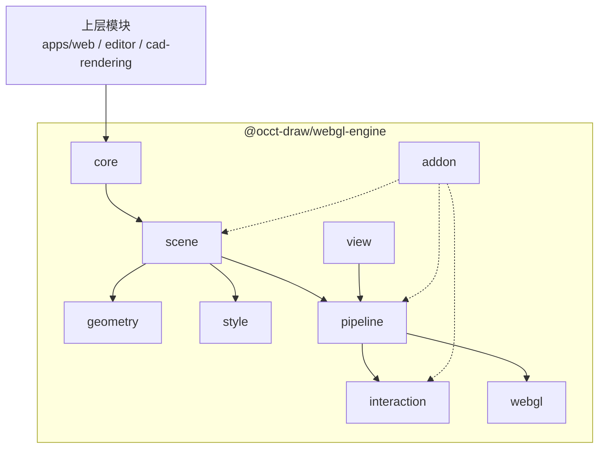

# WebGL 引擎架构设计

## 总架构图



## 模块和类

### core

引擎对象和生命周期，不放 WebGL 细节，也不放 CAD 业务模型。

- `RenderEngine`：引擎入口，持有渲染图、视口、管线和后端。
- `RenderGraph`：视口渲染图，管理 layer 和 object。
- `RenderLayer`：渲染层，用于模型、草图、辅助对象、overlay、widget 等分层。
- `RenderObject`：场景对象基类，包含 `id / name / visible / transform / bounds / pickable / metadata`。
- `RenderGroup`：场景对象分组。
- `RenderDirtyFlags`：表达 object、geometry、style、bounds 等局部更新状态。
- `RenderCapabilities`：运行时能力。
- `RenderStats`：帧统计信息。

### scene

CAD 视口渲染 primitive。这里不表达 `CadDocument / Sketch / Feature`，只表达引擎可渲染对象。

- `FaceSet`：面片集合。
- `EdgeSet`：边线集合。
- `PointSet`：点集合。
- `CurveSet`：曲线近似集合。
- `TextLabelSet`：文字集合。
- `MarkerSet`：固定像素 marker 集合。
- `OverlayObject`：overlay 对象。
- `ViewportWidget`：视口控件对象基类。

### geometry

GPU 上传前的几何数据结构。geometry 只负责数据，不负责样式和业务语义。

- `Geometry`
- `FaceGeometry`
- `EdgeGeometry`
- `PointGeometry`
- `CurveGeometry`
- `TextGeometry`
- `MarkerGeometry`
- `VertexBufferLayout`
- `GeometryBuffer`
- `IndexBuffer`
- `GeometryBounds`

### style

CAD 视口样式。这里不以通用 PBR material 为核心，而是表达工程视口需要的显示状态。

- `RenderStyle`
- `FaceStyle`
- `EdgeStyle`
- `PointStyle`
- `CurveStyle`
- `TextStyle`
- `MarkerStyle`
- `HighlightStyle`
- `HiddenLineStyle`
- `XRayStyle`
- `StyleResolver`

### view

视口和相机。该层负责屏幕尺寸、设备像素比、工程视图相机、fit 和 depth 反算。

- `RenderViewport`
- `ViewportSize`
- `ViewportRect`
- `Camera`
- `OrthographicCamera`
- `PerspectiveCamera`
- `StandardViewFrame`
- `CameraFitter`
- `CameraClipping`
- `CameraRay`
- `DepthUnprojector`

### pipeline

渲染管线和 pass 系统。pass 是 picking、depth sampling、highlight、overlay 等能力的主要扩展点。

- `RenderPipeline`
- `RenderPass`
- `PassRegistry`
- `RenderQueue`
- `DrawCommand`
- `ColorPass`
- `DepthPrepass`
- `PickIdPass`
- `NavigationDepthPass`
- `HighlightPass`
- `OverlayPass`
- `CompositePass`

### interaction

渲染相关交互数据。这里返回通用命中结果，上层再解释成 CAD 选择语义。

- `PickKey`
- `PickResult`
- `HitTester`
- `PickBuffer`
- `PickBufferReader`
- `NavigationDepthSampler`
- `SelectionHighlight`
- `HoverHighlight`
- `PreselectionHighlight`

### webgl

WebGL2 后端。该层负责 shader、buffer、texture、framebuffer 和 GPU 资源生命周期。

- `WebGLRenderer`
- `WebGLDevice`
- `ShaderProgram`
- `ShaderLibrary`
- `BufferManager`
- `TextureManager`
- `FramebufferManager`
- `VertexArrayManager`
- `ResourceRegistry`
- `ResourceCache`

### addon

可选能力类。addon 类由引擎包导出，应用层决定是否实例化、加入哪个 layer，以及如何处理事件。

- `ViewCube`：视口方向控件。
- `AxesHelper`：坐标轴辅助对象。
- `GridHelper`：网格辅助对象。
- `PlaneHelper`：基准面辅助对象。
- `OriginHelper`：原点辅助对象。
- `BoundsHelper`：包围盒辅助对象。
- `SectionPlaneWidget`：剖切平面控件。

## 导出约定

- 包入口优先导出类。
- 不导出散落流程函数。
- 公共 API 只从包入口导出，禁止上层 deep import 内部模块。
- 模块内 helper 默认保持私有。
- 可复用算法优先放入 `@occt-draw/math`。
- 引擎包只保留渲染对象、渲染管线、交互缓冲和 WebGL 资源管理相关逻辑。
- ViewCube、helper、overlay、label 等能力优先以类导出，应用层决定是否实例化和如何接入。

## 公共 API 目标

- `webgl-engine` 是可复用引擎包，不只服务当前 CAD 产品。
- 包入口只暴露少量稳定入口类、渲染对象类、pass 类和 addon 类。
- API 默认面向组合和扩展，不暴露内部管线细节。
- 新能力优先通过 `RenderObject / RenderPass / ViewportWidget` 扩展。
- 当前产品的业务约定不得进入公共 API。

## 生命周期约定

- 应用层负责创建 graph、layer、object 和 addon。
- `RenderEngine` 负责帧调度、pass 执行和后端资源生命周期。
- `RenderObject` 负责维护自身 geometry、style、bounds 和 dirty 状态。
- `WebGLRenderer` 只管理 GPU 资源，不持有业务状态。
- 旧 `RenderScene` 输入通过兼容适配器迁移到 `RenderGraph`，避免当前功能一次性重写。

## 实现优先级

### v1 引擎骨架

- `RenderEngine`
- `RenderGraph`
- `RenderLayer`
- `RenderObject`
- `RenderGroup`
- `RenderViewport`
- `OrthographicCamera`
- `CameraFitter`
- `FaceSet`
- `EdgeSet`
- `PointSet`
- `MarkerSet`
- `FaceGeometry`
- `EdgeGeometry`
- `PointGeometry`
- `FaceStyle`
- `EdgeStyle`
- `PointStyle`
- `MarkerStyle`
- `RenderPipeline`
- `RenderPass`
- `ColorPass`
- `WebGLRenderer`
- `ResourceRegistry`

### v2 CAD 视口基础

- `TextLabelSet`
- `ViewCube`
- `AxesHelper`
- `GridHelper`
- `PlaneHelper`
- `OriginHelper`
- `PickKey`
- `PickResult`
- `PickIdPass`
- `NavigationDepthPass`
- `HighlightPass`
- `SelectionHighlight`
- `HoverHighlight`
- `PreselectionHighlight`
- layer depth policy
- incremental dirty update

### v3 大模型和高级显示

- indexed geometry
- geometry range update
- instancing
- render queue sorting
- hidden-line pass
- xray pass
- section clipping
- silhouette edge
- multi viewport
- offscreen snapshot
- render stats panel

### future 后端和质量增强

- WebGPU backend
- worker geometry preparation
- high quality text shaping
- screen-space anti-aliasing
- large assembly streaming
- progressive rendering

## v1 最小接口草案

### RenderEngine

```ts
class RenderEngine {
    constructor(options: RenderEngineOptions);

    readonly viewport: RenderViewport;
    readonly renderer: WebGLRenderer;
    readonly pipeline: RenderPipeline;

    setGraph(graph: RenderGraph): void;
    render(camera: Camera): void;
    resize(size: ViewportSize): void;
    dispose(): void;
}
```

### RenderGraph

```ts
class RenderGraph {
    readonly layers: readonly RenderLayer[];
    readonly bounds: GeometryBounds;

    addLayer(layer: RenderLayer): void;
    removeLayer(layer: RenderLayer): void;
    clear(): void;
}
```

### RenderLayer

```ts
class RenderLayer {
    constructor(name: string, options?: RenderLayerOptions);

    readonly name: string;
    readonly objects: readonly RenderObject[];
    visible: boolean;

    add(object: RenderObject): void;
    remove(object: RenderObject): void;
    clear(): void;
}
```

### RenderObject

```ts
abstract class RenderObject {
    readonly id: string;
    name: string;
    visible: boolean;
    pickable: boolean;
    metadata: ReadonlyMap<string, unknown>;

    abstract readonly bounds: GeometryBounds;
    abstract readonly dirtyFlags: RenderDirtyFlags;

    markDirty(flags: RenderDirtyFlags): void;
    clearDirty(): void;
}
```

### Render primitive

```ts
class EdgeSet extends RenderObject {
    constructor(geometry: EdgeGeometry, style: EdgeStyle, options?: RenderObjectOptions);

    geometry: EdgeGeometry;
    style: EdgeStyle;
}

class FaceSet extends RenderObject {
    constructor(geometry: FaceGeometry, style: FaceStyle, options?: RenderObjectOptions);

    geometry: FaceGeometry;
    style: FaceStyle;
}

class PointSet extends RenderObject {
    constructor(geometry: PointGeometry, style: PointStyle, options?: RenderObjectOptions);

    geometry: PointGeometry;
    style: PointStyle;
}
```

### RenderPass

```ts
abstract class RenderPass {
    readonly name: string;

    abstract execute(context: RenderPassContext): void;
}
```

### Addon 使用方式

```ts
const graph = new RenderGraph();
const overlayLayer = new RenderLayer('overlay');
const viewCube = new ViewCube({
    sizePixels: 150,
    placement: 'top-right',
});

overlayLayer.add(viewCube);
graph.addLayer(overlayLayer);
```

应用层负责处理事件：

```ts
const hit = viewCube.hitTest(viewportPoint, camera);

if (hit) {
    navigation.setStandardView(hit.view);
}
```

## 实施方案

### 实施原则

- 每个阶段必须可以独立构建和验证。
- 先新增新类体系，再通过兼容层切换旧实现，最后删除旧协议。
- 当前渲染功能在迁移期间不得回退。
- 公共 API 只做加法，旧 API 到最后清理阶段再移除。
- 每个阶段完成后至少运行 `pnpm typecheck` 和 `pnpm build`。

### 阶段 0：基线确认

目标：冻结当前渲染行为，避免重构过程中无法判断是否回退。

- 记录当前必须保持的功能：
    - 基准面面片、边框和 label。
    - 原点 marker。
    - 草图线和草图点。
    - draft 临时线和临时点。
    - ViewCube 渲染、hover、点击切视图。
    - picking。
    - navigation depth sampling。
- 补充最小 smoke 验证说明或测试用例。
- 确认当前 `pnpm typecheck` 和 `pnpm build` 可通过。

验收标准：

- 当前应用能正常启动。
- 当前视口基础对象和 ViewCube 行为无已知回退。

### 阶段 1：类骨架落地

目标：建立新引擎对象模型，但不改变当前应用渲染路径。

- 新增 `core`：
    - `RenderEngine`
    - `RenderGraph`
    - `RenderLayer`
    - `RenderObject`
    - `RenderGroup`
- 新增 `scene`：
    - `EdgeSet`
    - `FaceSet`
    - `PointSet`
    - `MarkerSet`
- 新增 `geometry`：
    - `EdgeGeometry`
    - `FaceGeometry`
    - `PointGeometry`
- 新增 `style`：
    - `EdgeStyle`
    - `FaceStyle`
    - `PointStyle`
    - `MarkerStyle`
- 包入口只导出上述公共类。
- 不改 `apps/web` 当前调用链。

验收标准：

- 新类可被包入口导入。
- 没有 deep import 需求。
- 旧渲染路径不变。

### 阶段 2：兼容适配层

目标：让旧 `RenderScene` 可以映射到新 `RenderGraph`。

- 新增 `RenderSceneCompatAdapter`。
- 映射关系：
    - `line-batch` -> `EdgeSet`
    - `surface-batch` -> `FaceSet`
    - `point-batch` -> `PointSet`
    - `marker-batch` -> `MarkerSet`
    - `label-batch` 暂时保留旧 label 渲染路径，后续迁移到 `TextLabelSet`
- 保留 `createWebglRenderer` 作为兼容 facade。
- `createWebglRenderer().render(input)` 内部先构建 `RenderGraph`，再交给新引擎骨架。

验收标准：

- `apps/web` 不改调用方式也能通过新骨架渲染。
- 基准面、原点、草图线、草图点、临时线和临时点显示不回退。

### 阶段 3：管线类迁移

目标：把当前集中式 `renderPipeline` 拆到 pass 类中。

- 新增 `RenderPipeline`。
- 新增 `RenderPass` 基类。
- 新增 `ColorPass`，承接当前 surface、line、point、marker 绘制。
- 新增 `OverlayPass`，承接 overlay 绘制入口。
- `WebGLRenderer` 只负责后端资源和 draw command 执行。
- 原 `renderPipeline` 降为内部兼容实现，随后删除公共导出。

验收标准：

- 主视口绘制从 `RenderPipeline` 执行。
- 当前颜色、透明度、深度测试行为不回退。
- 包入口不暴露旧流程函数。

### 阶段 4：交互能力迁移

目标：把 picking、navigation depth、highlight 收口到 interaction 和 pass 类。

- 新增 `PickKey / PickResult`。
- 新增 `PickIdPass` 或 `HitTester`，替代公开 `pickRenderNode`。
- 新增 `NavigationDepthPass / NavigationDepthSampler`，替代公开 depth sampling 流程函数。
- 新增 `HighlightPass` 和 `SelectionHighlight / HoverHighlight / PreselectionHighlight`。
- 当前应用先通过兼容 facade 调用这些类。

验收标准：

- 选择、hover、草图交互依赖的命中结果不回退。
- navigation orbit pivot 相关 depth sampling 不回退。
- 高亮状态进入渲染管线，但不要求一次完成所有视觉样式。

### 阶段 5：addon 类迁移

目标：把 ViewCube 和 helper 做成应用层可组合类。

- 新增 `ViewCube`，继承或组合 `ViewportWidget`。
- `ViewCube` 提供：
    - 渲染对象能力。
    - `hitTest(point, camera)`。
    - hover 状态更新。
- `apps/web` 创建 `ViewCube` 实例并加入 overlay layer。
- ViewCube 命中后的相机切换仍由应用层处理。
- 后续再补 `AxesHelper / GridHelper / PlaneHelper / OriginHelper`。

验收标准：

- ViewCube 仍显示在右上角。
- hover 和点击切视图不回退。
- ViewCube 不再作为 renderer 内部硬编码 overlay。

### 阶段 6：应用层切换

目标：让当前产品直接使用新公共 API。

- `cad-rendering` 改为输出 `RenderGraph`。
- `apps/web` 持有 `RenderEngine` 实例。
- `apps/web` 调用：
    - `engine.setGraph(graph)`
    - `engine.render(camera)`
    - `engine.resize(viewportSize)`
- 旧 `RenderScene` 只保留在兼容适配层中。

验收标准：

- 当前产品不再直接依赖旧 `RenderScene` DTO。
- 当前视口显示、交互、ViewCube 行为无已知回退。

### 阶段 7：清理旧协议

目标：删除旧临时协议和公开流程函数。

- 删除旧 `RenderNodeKind` 分支式公共入口。
- 删除旧 `RenderScene` DTO 的公共导出。
- 删除散落的公开流程函数。
- 包入口只保留稳定类、类型和少量 value object。
- 文档和代码导出保持一致。

验收标准：

- 上层只能通过包入口使用 `webgl-engine`。
- 没有上层 deep import。
- `pnpm typecheck`、`pnpm build`、`pnpm depcruise` 通过。
