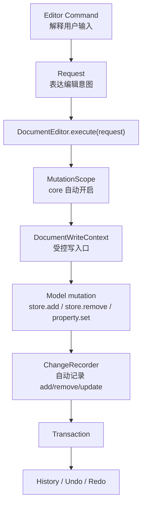

# 文档编辑事务架构重构方案

## 背景

当前项目已经完成一轮重要收口：

- `CadDocumentEditContext` 已把 Sketch 修改从 `SketchEdit -> Transaction<Sketch> -> map Transaction<CadDocument>` 的链路，收敛为 Document 级 Request 内部的编辑上下文。
- `SketchPrimitiveBuilder` 已承担点、顶点、曲线、边等草图基础对象创建。
- `SketchEdit` 类族已不再作为主要 public 编辑入口。

但当前架构仍然是过渡形态：

```txt
Request.execute()
  -> CadDocumentEditContext.begin()
  -> requireSketchTarget()
  -> target.primitives.xxx()
  -> finish()
  -> RequestExecution { transaction, result }
  -> DocumentSession.execute() 应用 transaction
```

这说明 `Request` 仍然参与事务生成，业务层仍然能看到 begin / finish / target / primitive 这类事务细节。长期目标应该是：

```txt
Command -> Request -> 修改模型
                  ↓
          core 自动记录 change
                  ↓
          core 自动生成 transaction
                  ↓
          history / undo / redo
```

业务 Request 应只表达“我要怎么改数据”，不应手动创建、返回或组装 transaction。

## 核心判断

本项目当前的正式聚合根是 `CadDocument`。

因此在 Sketch 中新增一条线，本质上是修改 `CadDocument` 内部的 Sketch payload，应表现为一个 Document 级 Request：

```txt
SketchAddLineCommand
  -> AddSketchLineRequest<CadDocument>
  -> DocumentEditor.execute(request)
  -> core 自动记录 model changes
  -> core 自动生成 Transaction<CadDocument>
```

不采用：

```txt
ApplySketchRequest<CadDocument>
  -> AddLineSegmentRequest<Sketch>
```

除非未来 Sketch 变成独立可保存、独立 undo/redo 的子文档，否则不要引入 `Request<Sketch>` 作为正式业务入口。

## 目标架构



## 概念定义

### DocumentEditor

替代或重命名当前 `DocumentSession` 的核心职责。

职责：

- 持有当前 document。
- 统一执行 Request。
- 自动打开 MutationScope。
- 自动生成 Transaction。
- 自动写入 History。
- 提供 undo / redo / beginScope / commitScope / cancelScope。

建议 API：

```ts
class DocumentEditor<TDocument> {
    execute<TResult>(request: DocumentRequest<TDocument, TResult>): DocumentRequestResult<TResult>;
    undo(): DocumentEditResult<TDocument>;
    redo(): DocumentEditResult<TDocument>;
    get document(): TDocument;
}
```

### Request

正式数据修改入口。

Request 只返回业务结果，不返回 transaction。

建议接口：

```ts
abstract class DocumentRequest<TDocument, TResult> {
    abstract readonly id: string;
    abstract readonly label: string;
    abstract execute(context: DocumentWriteContext<TDocument>): TResult;
}
```

业务 Request 示例：

```ts
class AddSketchLineRequest extends CadDocumentRequest<AddSketchLineResult> {
    public readonly id = `add-sketch-line:${this.input.sketchFeatureId}`;
    public readonly label = 'Add sketch line';

    public execute(ctx: CadDocumentWriteContext): AddSketchLineResult {
        const sketch = ctx.requireSketch(this.input.sketchFeatureId);
        return sketch.addLineSegment(this.input.line);
    }
}
```

### MutationScope

底层自动记账环境。

业务代码不应直接创建或操作 MutationScope。

职责：

- 在 `DocumentEditor.execute(request)` 内部自动创建。
- 持有 ChangeRecorder。
- 给 Request 提供 `DocumentWriteContext`。
- 收集模型层 add/remove/update。
- commit 时生成 Transaction。

伪代码：

```ts
execute(request) {
    const scope = MutationScope.begin(this.document, request);
    const result = request.execute(scope.context);
    const transaction = scope.commit();
    this.apply(transaction);
    this.history.record(transaction);
    return { result, transaction };
}
```

### DocumentWriteContext

Request 的受控写入口。

职责：

- 提供文档内部对象访问能力。
- 屏蔽 `PartStudio / Feature / Payload / Plane` 的穿透查询细节。
- 返回的对象必须是 tracked mutation facade。
- 不暴露 transaction、history、changeSet。

建议：

```ts
interface CadDocumentWriteContext {
    requireSketch(sketchFeatureId: FeatureId): SketchWriteTarget;
    requirePartStudio(partStudioId: PartStudioId): PartStudioWriteTarget;
}

interface SketchWriteTarget {
    readonly id: SketchId;
    readonly featureId: FeatureId;
    readonly plane: Plane3;
    addLineSegment(input: SketchLineSegmentInput): SketchPrimitiveResult;
    addCircle(center: Vector2, radius: number): SketchPrimitiveResult;
    moveVertex(vertexId: SketchVertexId, target: Vector2): SketchPrimitiveResult;
    deleteEntity(ref: SketchEntityRef): SketchPrimitiveResult;
}
```

## 变更记录机制

所有模型修改必须通过 tracked API。

### 新增对象

```ts
store.add(edge)
```

底层自动记录：

```txt
kind: add
ref: edge.ref
value: edge.snapshot()
```

### 删除对象

```ts
store.remove(edgeId)
```

底层自动记录：

```txt
kind: remove
ref: edge.ref
value: oldSnapshot
```

### 修改属性

```ts
point.setPosition(next)
```

底层自动记录：

```txt
kind: update
ref: point.ref
propertyPath: ['position']
before: oldPosition
after: next
```

这要求底层模型提供统一的属性修改入口，避免直接赋值绕过记录。

## 包职责

### core

负责通用编辑基础设施：

- `DocumentEditor`
- `DocumentRequest`
- `MutationScope`
- `DocumentWriteContext`
- `ChangeRecorder`
- `Transaction`
- `History`
- tracked store / tracked property 基础能力

### cad-model

负责 CAD 文档聚合根与文档级 Request：

- `CadDocument`
- `PartStudio`
- `Feature`
- Sketch payload 定位
- `CadDocumentWriteContext`
- `AddSketchLineRequest`
- `AddSketchCircleRequest`
- `AddSketchRectangleRequest`
- `DeleteSketchEntityRequest`
- `MoveSketchVertexRequest`

### sketch

负责 Sketch 数据模型和领域构造：

- `Sketch`
- `Point2D / Curve2D / Vertex / Edge`
- `SketchPrimitiveBuilder`
- `SketchGeometryValidator`
- 不负责 document transaction
- 不暴露正式编辑 Request 入口

### editor

负责交互编排：

- Command 解释输入
- 创建 Document Request
- 维护临时交互状态
- 维护 EditDraft 预览
- 不直接修改模型
- 不处理 transaction

## 分阶段实施计划

### 阶段 1：并行引入新接口

目标：不立即破坏所有调用，先建立新 core 抽象。

任务：

1. 新增 `DocumentEditor`，可先包装现有 `DocumentSession`。
2. 新增 `DocumentRequest<TDocument, TResult>`，其 `execute(ctx)` 只返回 result。
3. 新增 `MutationScope` 和 `DocumentWriteContext` 类型。
4. 保留旧 `Request` 协议，但标记为 legacy。
5. 为 core 增加测试，覆盖 execute / undo / redo 基础流程。

验收：

- `pnpm check` 通过。
- 新旧 Request 可以并存。
- 不影响现有草图功能。

### 阶段 2：实现 tracked mutation 基础能力

目标：让模型 add/remove/update 自动记录 change。

任务：

1. 为 `ModelElementStore` 增加 tracked add/remove 机制。
2. 为 `ModelElement` 或属性容器增加 tracked property set 机制。
3. 在 MutationScope 中收集 add/remove/update。
4. update 必须记录 propertyPath、before、after。
5. add/remove 必须记录 entity ref 和 snapshot。

验收：

- 新增对象、删除对象、修改属性都能生成 change。
- undo / redo 能恢复。
- 覆盖单测：add、remove、update、update merge、revert。

### 阶段 3：迁移 CadDocument Sketch Request

目标：业务 Request 不再手动 begin / finish / transaction。

任务：

1. 将 `AddLineSegmentRequest` 等改为新 `DocumentRequest`。
2. Request 内只写：
   - `ctx.requireSketch(...)`
   - `sketch.addLineSegment(...)`
3. 移除 Request 内部的 `CadDocumentEditContext.begin()` 和 `finish()`。
4. `SketchPrimitiveBuilder` 只调用 tracked model API，不标记 changed，不生成 transaction。
5. editor 命令层不变，只继续创建 request。

验收：

- 草图线、圆、矩形、删除、移动点行为不变。
- Request 不返回 transaction。
- transaction 由 DocumentEditor 自动生成。

### 阶段 4：淘汰 CadDocumentEditContext 手动事务职责

目标：移除当前 edit context 的 begin / requireTarget / finish 手动事务流程。

任务：

1. 若仍需上下文能力，将其降级为 `CadDocumentWriteContext`。
2. 不再由它生成 Transaction。
3. 不再暴露 mutable Sketch。
4. Sketch 修改只能通过 tracked facade 或 SketchPrimitiveBuilder。
5. 删除旧 `RequestExecution` 依赖链路。

验收：

- 无业务 Request 调用 `finish()`。
- 无业务 Request 手动创建 `Transaction`。
- `CadDocumentEditContext` 删除或更名为 write context。

### 阶段 5：ChangeSet 纯数据化

目标：为 Worker、持久化、协作同步准备。

任务：

1. 将 Change 表达为纯数据 patch。
2. 去除或弱化 change 中的 target function。
3. 引入 `ModelChangeApplierRegistry`。
4. apply/revert 根据 `targetKind` 和 `ref` 执行。
5. 继续保留 `toSerializable()`，并让它成为核心形态。

验收：

- ChangeSet 可序列化。
- 反序列化后可 apply/revert。
- 事务测试通过。

## 非目标

本次重构不做：

- 约束求解器。
- Profile 自动识别。
- 拉伸特征重算。
- 多人协作协议。
- 云端存储协议。

但新架构必须为这些能力预留空间。

## 最终验收标准

- 新增一个草图功能时，只需要增加 Request 和必要模型方法。
- 不需要修改 transaction、history、changeSet 代码。
- 业务 Request 不返回 Transaction。
- 业务 Request 不手动 begin / finish。
- 模型 add/remove/update 自动记录 change。
- Change 中能明确记录：哪个对象、哪个属性、旧值、新值。
- Undo / Redo 通过自动生成的 Transaction 工作。
- `pnpm check` 通过。
