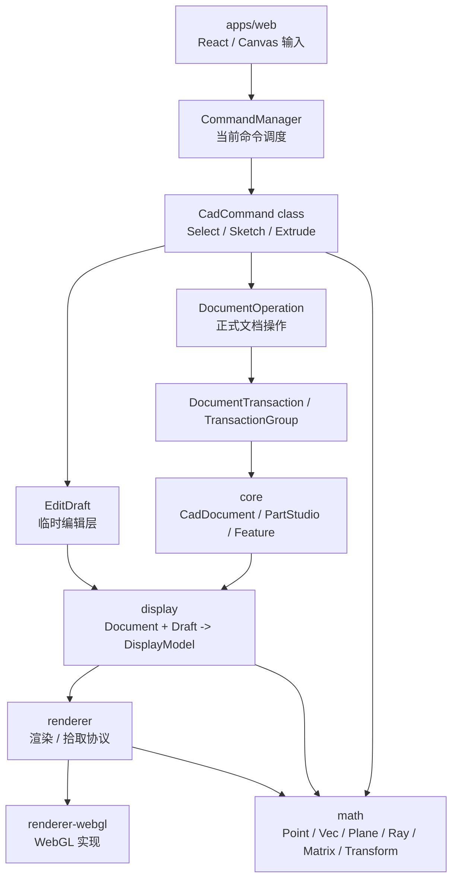
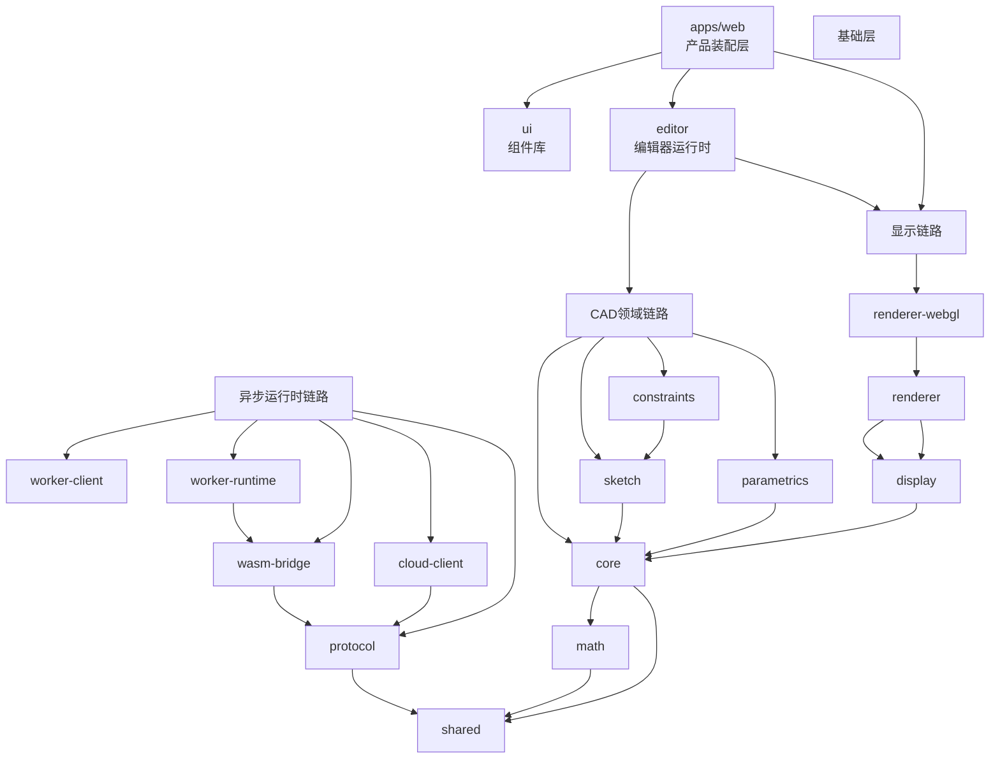
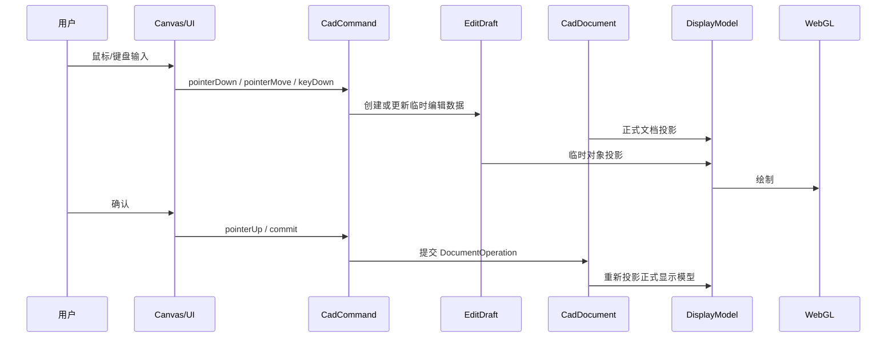

# 三维云端 CAD 架构设计

## 项目定位

`occt-draw-web` 是浏览器中的三维云端 CAD 前端工作台。当前仓库负责 React 工作台、命令系统、选择系统、CAD 文档状态、显示模型投影、WebGL 渲染、Worker/Wasm 边界和未来云端协作边界。

几何内核由 `occt-draw-core` Wasm 提供。前端 TypeScript 不实现底层 B-Rep、布尔、倒角、圆角等高精度几何内核能力。

## 总体架构



核心原则：

- React 只收集用户输入和展示状态，不直接写 CAD 文档。
- `CadCommand` 是用户操作入口，负责解释鼠标、键盘和工具栏输入。
- `EditDraft` 承载命令过程中的临时对象、临时真实数据和可取消预览。
- `DocumentOperation` 是正式文档修改动作，不等同于鼠标事件或 Request。
- `DocumentTransaction` 是一次原子提交，`TransactionGroup` 表示一次用户动作包含多次提交。
- `display` 只负责把 `CadDocument + EditDraft` 转成可渲染的 `DisplayModel`。
- `renderer` 只定义渲染、相机、拾取和高亮协议。
- `renderer-webgl` 只实现 WebGL 绘制，不知道命令、草图和文档编辑业务。

## 目标分层视图

这张图用于快速理解包分层和主依赖方向。`editor` 是已落地的编辑器运行时包，用于承接 UI 之外的命令、交互和编辑器状态流。



## 分包职责

```txt
apps/web                React + Vite 三维 CAD 工作台
packages/shared        最底层通用常量和稳定工具
packages/math          CAD 前端几何基础：点、向量、平面、射线、矩阵、变换、容差
packages/core          CAD 文档、PartStudio、对象、特征、选择、EditDraft、Operation、Transaction
packages/editor        编辑器运行时包，承接命令、交互、选择、视图状态和编辑器状态流
packages/display       Document + Draft 到 DisplayModel 的投影层
packages/renderer      相机、包围盒、拾取、渲染输入和高亮协议
packages/renderer-webgl WebGL 渲染后端
packages/sketch        后续草图工具流和草图编辑逻辑
packages/constraints   后续草图约束和尺寸约束
packages/parametrics   后续参数、表达式和特征驱动关系
packages/protocol      Worker、Wasm、云端任务消息协议
packages/wasm-bridge   occt-draw-core Wasm 桥接层
packages/worker-client 主线程 Worker 客户端
packages/worker-runtime Worker 侧任务调度
packages/cloud-client  云端项目、文件、版本、权限和协同客户端
packages/ui            自有 CAD 工作台组件库
packages/config        工程配置沉淀
```

## 编辑数据流



拖动类操作不能在每次 `pointerMove` 写入正式历史。标准规则是：

- `pointerDown` 创建或初始化 `EditDraft`。
- `pointerMove` 更新 `EditDraft` 或 `workingDocument`。
- `pointerUp` 生成一个 `DocumentOperation`、`DocumentTransaction` 或 `TransactionGroup`。
- `Esc` 丢弃 `EditDraft` 并回到选择命令。

## 公共 API 规则

- `src/index.ts` 只作为公共 API 门面，必须显式导出。
- 禁止 `export *`。
- 跨包只能从包入口导入，例如 `@occt-draw/core`，禁止 deep import。
- 允许导出函数，但函数必须归属于明确架构角色，例如工厂、查询、投影器或兼容层。
- `math` 新增能力优先用 class 表达，提供 `inPlace` 和返回新对象两类 API。
- 新写源码统一使用 TypeScript `private`，不再新增 `#private`。

## 依赖方向

```txt
shared
math -> shared
protocol -> shared
core -> math, shared
editor -> core, display, renderer, math, shared
sketch -> core, math, shared
constraints -> sketch, core, math, shared
parametrics -> core, shared
display -> core, math, shared
renderer -> display, math, shared
renderer-webgl -> renderer, display, math, shared
wasm-bridge -> protocol, shared
worker-client -> protocol, shared
worker-runtime -> wasm-bridge, protocol, shared
cloud-client -> protocol, shared
apps/web -> editor, ui, renderer-webgl, worker-client, cloud-client 等运行时包
```

该方向由 `dependency-cruiser` 自动检查。

## 当前阶段

当前处于第 1 阶段收口：CAD 工作台骨架和基础交互已经基本具备，正在进入草图系统 v1 前的架构基建整改。

本阶段不实现真实草图、不实现拉伸、不接 Wasm、不做 undo/redo UI。目标是把 `math/core/display/renderer/command/EditDraft/Operation` 边界稳定下来，保证下一阶段草图开发不会继续堆临时实现。
