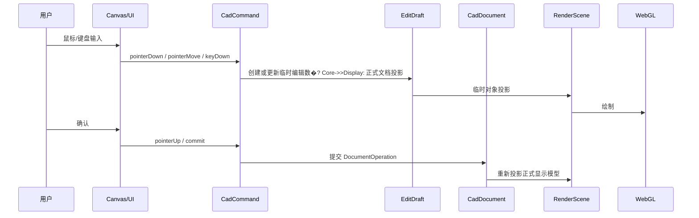

# 三维云端 CAD 架构设计

## 项目定位

`occt-draw-web` 是浏览器中的三维云端 CAD 前端工作台。当前仓库负�?React 工作台、命令系统、选择系统、CAD 文档状态、显示模型投影、WebGL 渲染、Worker/Wasm 边界和未来云端协作边界�?
几何内核�?`occt-draw-core` Wasm 提供。前�?TypeScript 不实现底�?B-Rep、布尔、倒角、圆角等高精度几何内核能力�?

## 总体架构

```mermaid
flowchart TB
    UI["apps/web<br/>React / Canvas 输入"] --> Command["CommandManager<br/>当前命令调度"]
    Command --> ActiveCommand["CadCommand class<br/>Select / Sketch / Extrude"]

    ActiveCommand --> Draft["EditDraft<br/>临时编辑�?]
    ActiveCommand --> Operation["DocumentOperation<br/>正式文档操作"]

    Operation --> Transaction["DocumentTransaction / TransactionGroup"]
    Transaction --> Core["core<br/>CadDocument / PartStudio / Feature"]

    Core --> Display["display<br/>Document + Draft -> RenderScene"]
    Draft --> Display

    Display --> Renderer["renderer<br/>渲染 / 拾取协议"]
    Renderer --> WebGL["webgl-engine<br/>WebGL 实现"]

    ActiveCommand --> Math["math<br/>Point / Vec / Plane / Ray / Matrix / Transform"]
    Display --> Math
    Renderer --> Math
```

核心原则�?

- React 只收集用户输入和展示状态，不直接写 CAD 文档�?- `CadCommand` 是用户操作入口，负责解释鼠标、键盘和工具栏输入�?- `EditDraft` 承载命令过程中的临时对象、临时真实数据和可取消预览�?- `DocumentOperation` 是正式文档修改动作，不等同于鼠标事件�?Request�?- `DocumentTransaction` 是一次原子提交，`TransactionGroup` 表示一次用户动作包含多次提交�?- `display` 只负责把 `CadDocument + EditDraft` 转成可渲染的 `RenderScene`�?- `renderer` 只定义渲染、相机、拾取和高亮协议�?- `webgl-engine` 只实�?WebGL 绘制，不知道命令、草图和文档编辑业务�?

## 目标分层视图

这张图用于快速理解包分层和主依赖方向。`editor` 是已落地的编辑器运行时包，用于承�?UI 之外的命令、交互和编辑器状态流�?

```mermaid
flowchart TB
  App["apps/web<br/>产品装配�?]

  Editor["editor<br/>编辑器运行时"]
  UI["ui<br/>组件�?]

  View["显示链路"]
  Domain["CAD领域链路"]
  Runtime["异步运行时链�?]
  Base["基础�?]

  App --> UI
  App --> Editor
  App --> View

  Editor --> Domain
  Editor --> View

  View --> RendererWebgl["webgl-engine"]
  RendererWebgl --> Renderer["renderer"]
  Renderer --> Display["display"]

  Domain --> Core["core"]
  Domain --> Sketch["sketch"]
  Domain --> Constraints["constraints"]
  Domain --> Parametrics["parametrics"]

  Runtime --> WorkerClient["worker-client"]
  Runtime --> WorkerRuntime["worker-runtime"]
  Runtime --> Wasm["wasm-bridge"]
  Runtime --> Cloud["cloud-client"]
  Runtime --> Protocol["protocol"]

  Core --> Math["math"]
  Sketch --> Core
  Constraints --> Sketch
  Parametrics --> Core

  Display --> Core
  Renderer --> Display
  WorkerRuntime --> Wasm
  Wasm --> Protocol
  Cloud --> Protocol

```

## 分包职责

```txt
packages/editor        编辑器运行时包，承接命令、交互、选择、视图状态和编辑器状态流
packages/cad-rendering       Document + Draft �?RenderScene 的业务渲染层
packages/webgl-engine      相机、包围盒、拾取、渲染输入和高亮协议
packages/webgl-engine WebGL 渲染后端
packages/sketch        后续草图工具流和草图编辑逻辑
packages/constraints   后续草图约束和尺寸约�?packages/parametrics   后续参数、表达式和特征驱动关�?packages/protocol      Worker、Wasm、云端任务消息协�?packages/wasm-bridge   occt-draw-core Wasm 桥接�?packages/worker-client 主线�?Worker 客户�?packages/worker-runtime Worker 侧任务调�?packages/cloud-client  云端项目、文件、版本、权限和协同客户�?packages/ui            自有 CAD 工作台组件库
packages/config        工程配置沉淀
```

## 编辑数据�?


```mermaid
sequenceDiagram
    participant User as 用户
    participant Canvas as Canvas/UI
    participant Command as CadCommand
    participant Draft as EditDraft
    participant Core as CadDocument
    participant Display as RenderScene
    participant WebGL as WebGL

    User->>Canvas: 鼠标/键盘输入
    Canvas->>Command: pointerDown / pointerMove / keyDown
    Command->>Draft: 创建或更新临时编辑数�?    Core->>Display: 正式文档投影
    Draft->>Display: 临时对象投影
    Display->>WebGL: 绘制

    User->>Canvas: 确认
    Canvas->>Command: pointerUp / commit
    Command->>Core: 提交 DocumentOperation
    Core->>Display: 重新投影正式显示模型
```

拖动类操作不能在每次 `pointerMove` 写入正式历史。标准规则是�?

- `pointerDown` 创建或初始化 `EditDraft`�?- `pointerMove` 更新 `EditDraft` �?`workingDocument`�?- `pointerUp` 生成一�?`DocumentOperation`、`DocumentTransaction` �?`TransactionGroup`�?- `Esc` 丢弃 `EditDraft` 并回到选择命令�?

## 公共 API 规则

- `src/index.ts` 只作为公�?API 门面，必须显式导出�?- 禁止 `export *`�?- 跨包只能从包入口导入，例�?`@occt-draw/core`，禁�?deep import�?- 允许导出函数，但函数必须归属于明确架构角色，例如工厂、查询、投影器或兼容层�?- `math` 新增能力优先�?class 表达，提�?`inPlace` 和返回新对象两类 API�?- 新写源码统一使用 TypeScript `private`，不再新�?`#private`�?

## 依赖方向

````txt
math -> none
protocol -> none
core -> math
sketch -> core, math
constraints -> sketch, core, math
parametrics -> core
cad-rendering -> webgl-engine, core, sketch, math
webgl-engine -> math
wasm-bridge -> protocol
worker-client -> protocol
worker-runtime -> wasm-bridge, protocol
cloud-client -> protocol
apps/web -> editor, ui, webgl-engine, worker-client, cloud-client 等运行时�?```

该方向由 `dependency-cruiser` 自动检查�?
## 当前阶段

当前处于�?1 阶段收口：CAD 工作台骨架和基础交互已经基本具备，正在进入草图系�?v1 前的架构基建整改�?
本阶段不实现真实草图、不实现拉伸、不�?Wasm、不�?undo/redo UI。目标是�?`math/core/display/renderer/command/EditDraft/Operation` 边界稳定下来，保证下一阶段草图开发不会继续堆临时实现�?
## 数据模型层分包边界（2026-05-17�?
数据模型层按“通用机制 -> 草图领域 -> CAD 文档模型”的方向收敛�?
```mermaid
flowchart TB
  CadModel["cad-model<br/>CAD Document / PartStudio / Feature tree / datum geometry"]
  Sketch["sketch<br/>Sketch payload / geometry / topology / request"]
  Core["core<br/>generic data mechanisms"]
  Math["math<br/>geometry math"]

  CadModel --> Sketch --> Core --> Math
````

职责边界�?
关键决策�?

- `Feature.type = 'sketch'` �?`payloadRef -> Sketch` 的集成关系放�?`cad-model`，不新增 `sketch-feature`�?- `findSketchByFeatureId / getSketchForFeature / getSketchPayload` 属于 Document/Feature �?Sketch 的集成查询，已从 `sketch` 迁到 `cad-model`�?- `core` 不再导出 `CadDocument / PartStudio / Feature / ReferencePlaneObject / createDefaultCadDocument`�?
