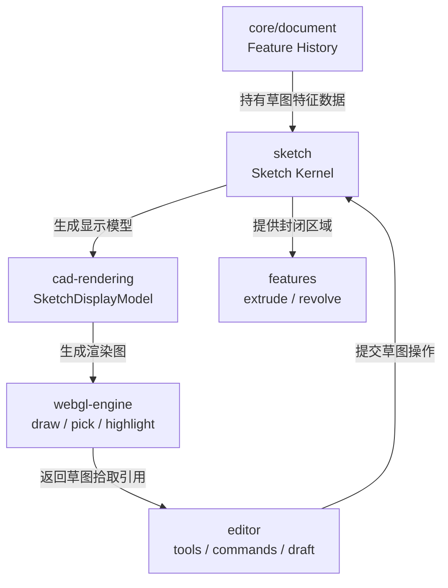
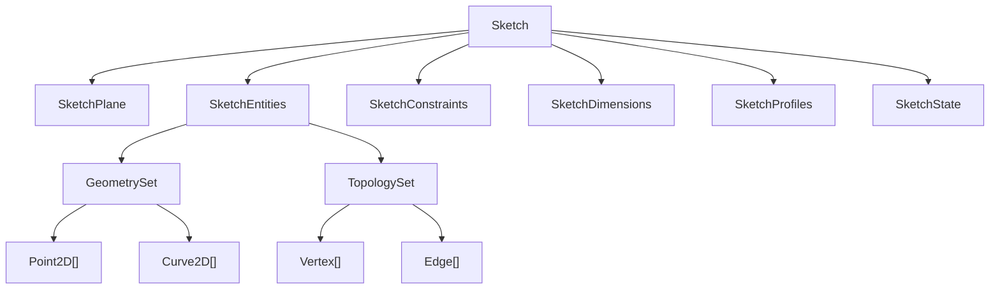
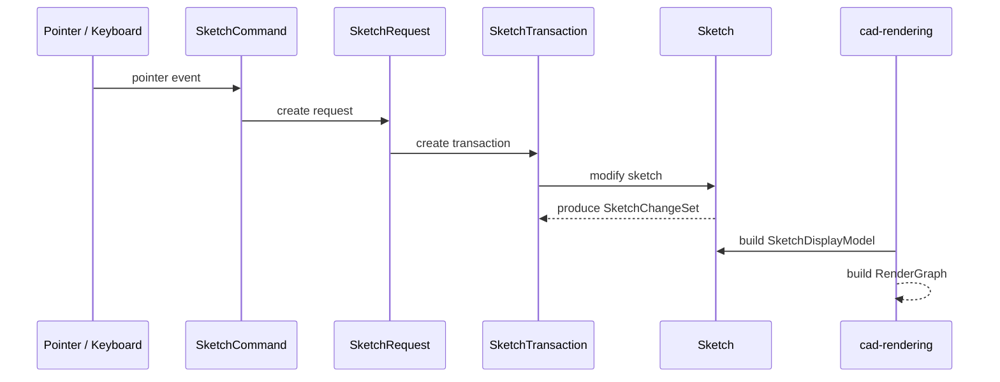
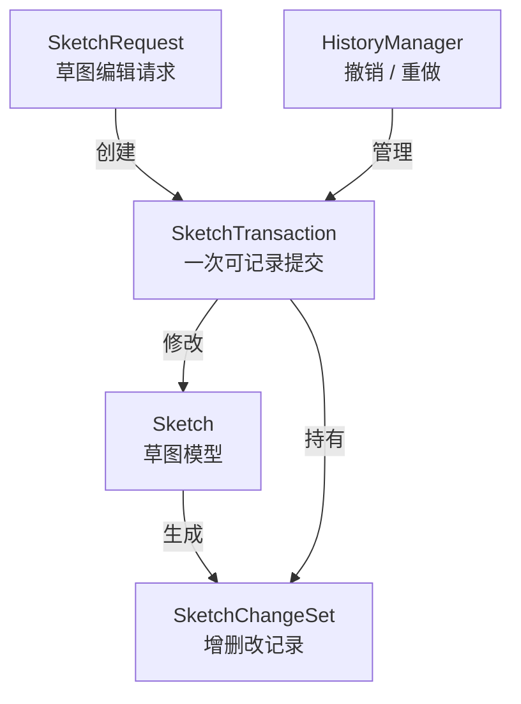

# 草图架构设计

## 设计依据

本设计参考参数化 CAD 草图器的通用分层：草图是 Feature History 中的一个参数化特征，内部由二维几何、拓扑实体、约束系统、求解状态和派生 Profile 共同组成。工程实现上，草图内核不直接依赖 editor、rendering 或 WebGL。

参考对象：

- FreeCAD Sketcher：草图包含几何、约束、构造几何、Profile 规则和求解状态。
- SolveSpace：以 request/entity/constraint/group/workplane 组织参数化草图与求解。
- 几何约束求解研究：约束图、自由度分析、分解求解、冗余/欠约束诊断是 CAD sketcher 的核心问题。

## 草图模块总架构



## 草图内核对象关系



## 命令到渲染的数据流



## 草图变更记录与撤销重做



## 当前包边界（2026-05-17）

草图包现在只表达草图内部事实：

- 草图平面引用：`SketchPlane` 只保存 `planeKind / planeRef`，其中 `planeKind` 是草图包内的 `SketchPlaneKind`，不再从 CAD 文档对象层导入。
- 草图实体：`Point2D / Line2D / Vertex / Edge / SketchEntities / GeometrySet / TopologySet`。
- 草图编辑：`SketchRequest / SketchTransaction / SketchChangeSet`。

草图不是自己管理 Feature tree。Sketch 作为 CAD 内置 Feature 的关系由 `@occt-draw/cad-model` 表达：

```txt
PartStudio.features[] contains Feature(type = 'sketch')
Feature.payloadRef points to Sketch payload
cad-model.getSketchForFeature(...) resolves that payload
```

这保证 `sketch` 可以作为独立草图领域模型持续演进，而 `cad-model` 负责 CAD 文档、Feature 历史和 Sketch payload 的集成。
