# 草图系统架构设计

## 目标

草图系统是参数化建模的二维编辑层。它负责在工作平面上创建、编辑、约束和解析二维几何，并为拉伸、旋转、切除等三维特征提供稳定的截面引用。

本文档定义草图的长期基础形态。当前“基准面建草图 + 直线绘制”只是过渡实现，不能继续按画布对象列表扩展。目标是把草图升级为 **二维参数化拓扑模型**。

不在本文范围内：

- 不实现 B-Rep、布尔、倒角、圆角。
- 不在 TypeScript 中实现真实三维几何内核。
- 不把 `webgl-engine` 变成 CAD 业务层。

## 一眼总览

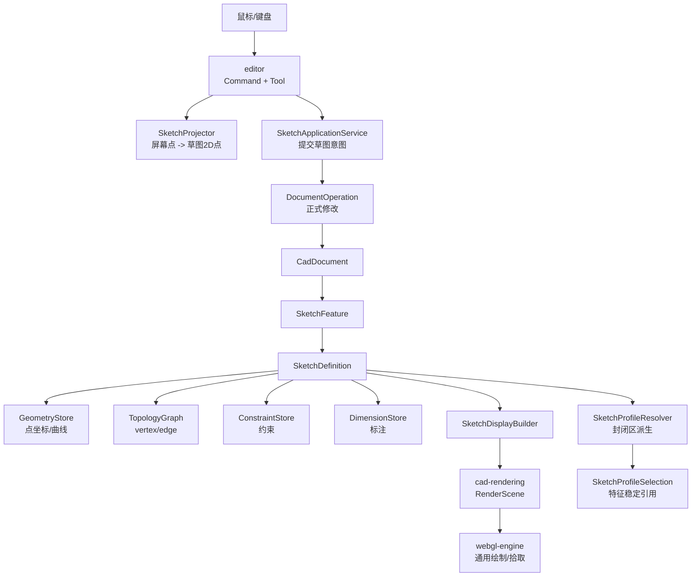

核心结论：

| 层              | 做什么                                 | 不做什么                    |
| --------------- | -------------------------------------- | --------------------------- |
| `editor`        | 解释输入、维护工具状态                 | 不创建底层 point/curve/edge |
| `sketch`        | 草图模型、拓扑、领域操作、Profile 解析 | 不关心 WebGL                |
| `core`          | 文档、Feature、Operation、事务         | 不写草图几何算法            |
| `cad-rendering` | 草图显示模型转 `RenderScene`           | 不改草图数据                |
| `webgl-engine`  | 绘制、拾取、相机                       | 不知道草图业务              |

## 设计原则

1. 草图是正式文档数据，不是 `EditorState` 里的临时对象。
2. 几何和拓扑分离：geometry 描述形状，topology 描述连接。
3. 用户选择、约束、标注、Profile 和特征引用都基于稳定 `SketchRef`。
4. Profile 是派生结果，不作为用户直接编辑的主数据。
5. 拖动和约束求解优先更新 geometry，保持 topology id 稳定。
6. 正式修改必须走 `DocumentOperation`，临时预览才进 `EditDraft`。
7. 命令层只表达用户意图，不能散改草图内部结构。

## 数据模型

### 聚合根

`SketchDefinition` 是草图最大的领域对象，也是 sketch feature 的 payload。它维护草图内部一致性。

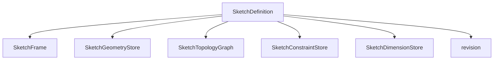

```ts
interface SketchDefinition {
    readonly id: SketchId;
    readonly name: string;
    readonly frame: SketchFrame;
    readonly geometry: SketchGeometryStore;
    readonly topology: SketchTopologyGraph;
    readonly constraints: SketchConstraintStore;
    readonly dimensions: SketchDimensionStore;
    readonly revision: number;
}
```

第一版 `SketchFrame` 只保存基准面引用：

```ts
interface SketchFrame {
    readonly planeRef: string;
    readonly planeKind: ReferencePlaneKind;
}
```

原因：

- 草图二维坐标通过 `ReferencePlaneObject -> Plane3` 和 `Plane3.localToWorld / projectPointToLocal` 转换。
- 不复制 `origin / xAxis / yAxis / normal`，避免和基准面产生双源不一致。
- 后续支持偏置平面、派生平面、冻结草图平面时，再扩展 frame。

### 几何层

Geometry 只表达数学形状。

```ts
interface SketchGeometryStore {
    readonly points: Readonly<Record<SketchPointGeomId, SketchPointGeom>>;
    readonly curves: Readonly<Record<SketchCurveGeomId, SketchCurveGeom>>;
}

interface SketchPointGeom {
    readonly id: SketchPointGeomId;
    readonly position: Vec2;
}

type SketchCurveGeom =
    | SketchLineCurveGeom
    | SketchCircleCurveGeom
    | SketchArcCurveGeom
    | SketchSplineCurveGeom;

interface SketchLineCurveGeom {
    readonly id: SketchCurveGeomId;
    readonly kind: 'line';
    readonly origin: Vec2;
    readonly direction: Vec2;
}
```

关键点：**线不是 start/end 两个点。线是数学曲线，edge 才是曲线上的一段。**

### 拓扑层

Topology 表达 vertex / edge 的连接关系。

```ts
interface SketchTopologyGraph {
    readonly vertices: Readonly<Record<SketchVertexId, SketchVertex>>;
    readonly edges: Readonly<Record<SketchEdgeId, SketchEdge>>;
}

interface SketchVertex {
    readonly id: SketchVertexId;
    readonly pointId: SketchPointGeomId;
}

interface SketchEdge {
    readonly id: SketchEdgeId;
    readonly curveId: SketchCurveGeomId;
    readonly startVertexId: SketchVertexId;
    readonly endVertexId: SketchVertexId;
    readonly parameterRange: SketchCurveParameterRange;
    readonly role: SketchEdgeRole;
}

type SketchEdgeRole = 'normal' | 'construction';

interface SketchCurveParameterRange {
    readonly start: number;
    readonly end: number;
}
```

线段在模型中的真实组成：

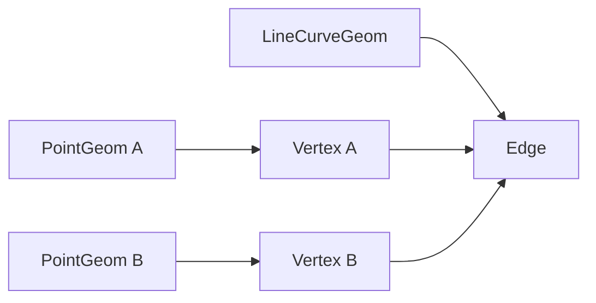

这比 `SketchLine { startPointId, endPointId }` 稳定，因为后续圆弧、裁剪、split、Profile、约束和特征引用都需要 edge/curve 分离。

### 统一引用

`SketchRef` 是草图内外的统一引用协议。

```ts
type SketchRef =
    | {
          readonly kind: 'sketch-vertex';
          readonly sketchId: SketchId;
          readonly vertexId: SketchVertexId;
      }
    | { readonly kind: 'sketch-edge'; readonly sketchId: SketchId; readonly edgeId: SketchEdgeId }
    | {
          readonly kind: 'sketch-curve';
          readonly sketchId: SketchId;
          readonly curveId: SketchCurveGeomId;
      }
    | {
          readonly kind: 'sketch-point';
          readonly sketchId: SketchId;
          readonly pointId: SketchPointGeomId;
      }
    | {
          readonly kind: 'sketch-profile';
          readonly sketchId: SketchId;
          readonly profile: SketchProfileSelection;
      };
```

使用场景：

| 场景            | 引用                              |
| --------------- | --------------------------------- |
| 选择端点        | `sketch-vertex`                   |
| 选择线段/圆弧边 | `sketch-edge`                     |
| 约束无限线/圆   | `sketch-curve`                    |
| 移动点坐标      | `sketch-point` 或 `sketch-vertex` |
| 拉伸封闭区      | `sketch-profile`                  |

## 文档持久化

目标形态：

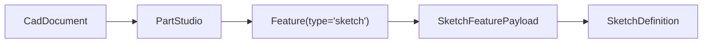

```ts
interface SketchFeaturePayload {
    readonly kind: 'sketch';
    readonly sketch: SketchDefinition;
}
```

过渡方案可以短期使用：

```txt
Feature.payloadRef -> CadDocument.sketchesById[sketchId]
```

但不能继续把真实草图数据长期放在 `EditorState.sketchesById`。`EditorState` 只保存：

- 当前激活草图 id。
- 当前工具状态。
- 临时 draft。
- selection。
- navigation。

## 数据修改流

正式修改路径：

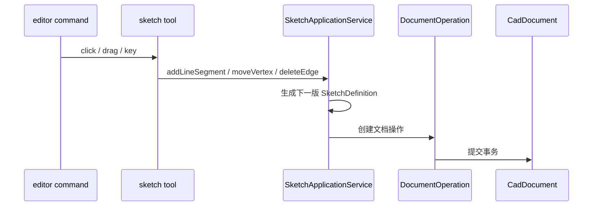

临时预览路径：

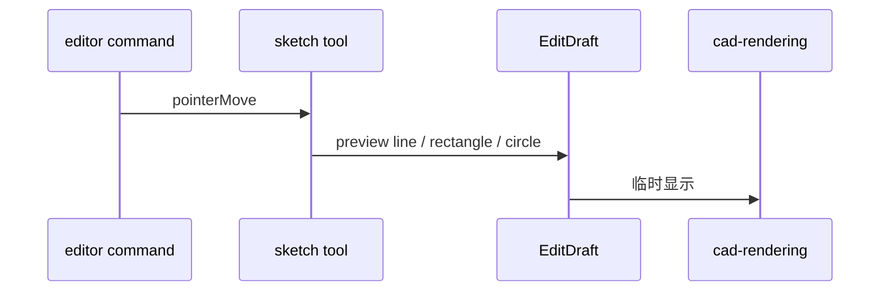

规则：

- 第一次点线起点可以只进入 tool state，不必写正式文档。
- 第二次确认线段时，一次 `DocumentOperation` 创建完整 point geom、vertex、line curve、edge。
- 取消命令只清理 tool state 和 draft，不应该回滚正式草图数据。

## 领域操作抽象

命令层不直接创建 id，不直接改 store。

```ts
interface SketchApplicationService {
    addLineSegment(input: AddLineSegmentInput): SketchChange;
    moveVertex(input: MoveVertexInput): SketchChange;
    deleteEdge(input: DeleteEdgeInput): SketchChange;
}

interface SketchChange {
    readonly sketchId: SketchId;
    readonly beforeRevision: number;
    readonly after: SketchDefinition;
    readonly affectedRefs: readonly SketchRef[];
}
```

`addLineSegment(start, end)` 内部负责：

1. 创建 `PointGeom A/B`。
2. 创建 `Vertex A/B`。
3. 创建 `LineCurveGeom`。
4. 创建 `Edge`。
5. 校验引用完整性。
6. 返回 revision + 1 的 `SketchDefinition`。

## 交互设计

### 命令层职责

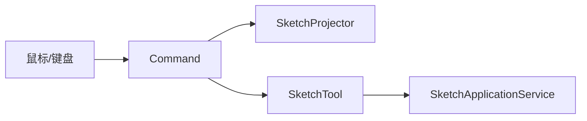

`editor` 负责：

- 接收 pointer / keyboard。
- 判断当前命令和工具状态。
- 调用 `SketchProjector` 把屏幕点转为草图二维点。
- 调用 tool。
- 应用 tool 返回的 draft 或 operation。

`editor` 不负责：

- 创建 point / curve / vertex / edge。
- 拼接草图 id。
- 维护 topology graph。
- 解析 Profile。

### 直线工具

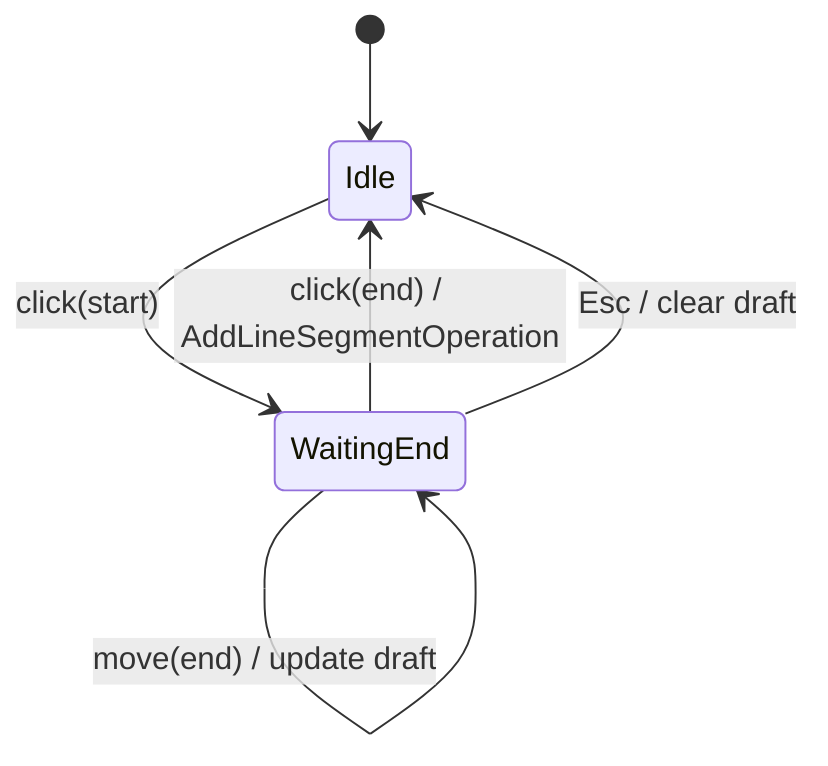

工具状态：

```ts
type SketchToolState =
    | { readonly kind: 'idle' }
    | { readonly kind: 'line-waiting-end'; readonly start: Vec2 };
```

## 坐标转换

统一投影链路：

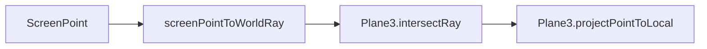

显示链路：

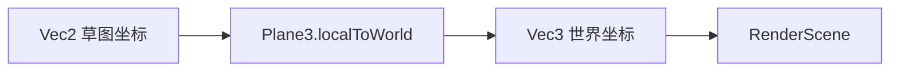

要求：

- 草图主数据只保存二维坐标。
- 三维点只在显示、拾取、导航和特征转换时派生。
- 命令层必须复用统一投影逻辑，不能各自手写。

## 渲染与拾取

### 渲染数据流

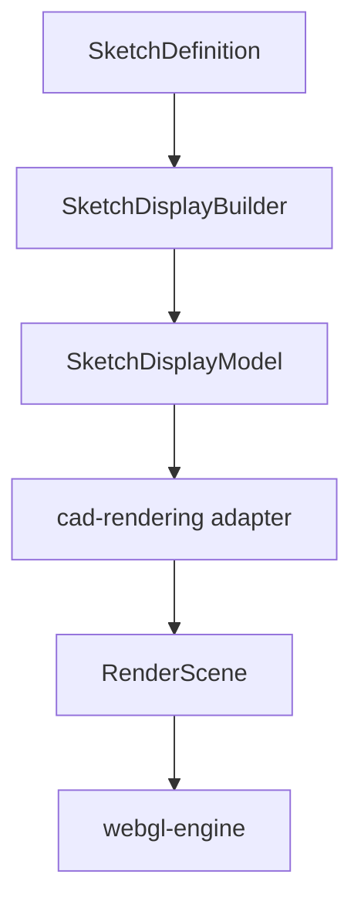

`SketchDisplayModel` 是草图业务显示模型，已经带好 `SketchRef`：

```ts
interface SketchDisplayModel {
    readonly sketchId: SketchId;
    readonly edges: readonly SketchDisplayEdge[];
    readonly vertices: readonly SketchDisplayVertex[];
    readonly profiles: readonly SketchDisplayProfile[];
}

interface SketchDisplayEdge {
    readonly ref: SketchRef;
    readonly curve: DisplayCurve2;
    readonly style: SketchDisplayStyle;
}

interface SketchDisplayVertex {
    readonly ref: SketchRef;
    readonly position: Vec2;
    readonly style: SketchDisplayStyle;
}
```

`cad-rendering` 负责：

- 把 `SketchDisplayModel` 从草图二维坐标投影到世界坐标。
- 生成 line / point / surface render node。
- 保留每个 item 的 `SketchRef`，用于拾取回溯。

`webgl-engine` 负责：

- 画线、点、面、label。
- 返回通用命中结果。
- 不知道 `SketchDefinition`、约束、Profile 语义。

### 拾取要求

当前“一个草图一个 line-batch”粒度不够。目标是 item 级拾取：

```ts
interface RenderPickItem {
    readonly renderNodeId: string;
    readonly itemId: string;
    readonly ref?: SketchRef;
}
```

拾取返回后，editor 只消费 `SketchRef`，不反查渲染内部结构。

## Profile 与封闭区

Profile 是派生结果：

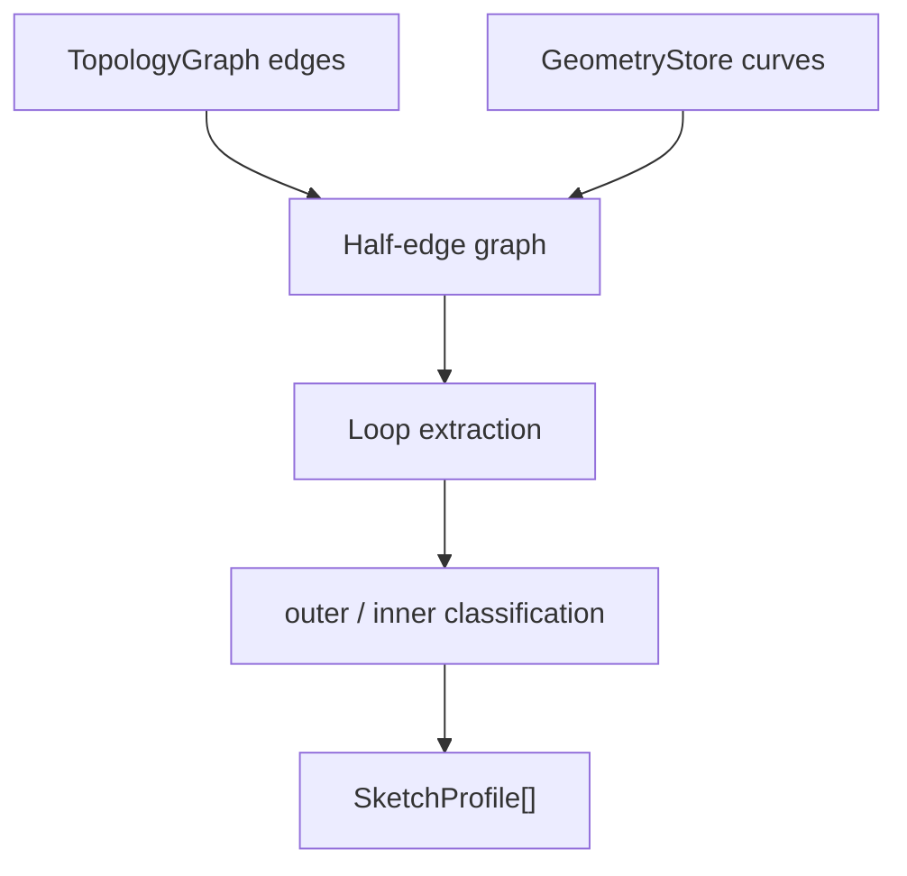

```ts
interface SketchProfile {
    readonly id: SketchProfileId;
    readonly sketchId: SketchId;
    readonly outerLoop: SketchLoop;
    readonly innerLoops: readonly SketchLoop[];
    readonly area: number;
    readonly centroid: Vec2;
    readonly bounds: BBox2;
}

interface SketchLoop {
    readonly id: SketchLoopId;
    readonly edges: readonly SketchProfileEdge[];
    readonly signedArea: number;
    readonly winding: 'clockwise' | 'counter-clockwise';
}

interface SketchProfileEdge {
    readonly edgeId: SketchEdgeId;
    readonly startVertexId: SketchVertexId;
    readonly endVertexId: SketchVertexId;
    readonly reversed: boolean;
}
```

第一版 Profile Resolver：

- 只支持 line edge。
- 支持多个独立闭合区。
- 支持外环和洞的基础判断。
- 不处理相交但未 split 的线。
- 不处理自交。
- 不处理曲线精确 Profile。

## 特征引用

特征不能保存临时 `SketchProfile.id`。拉伸等特征保存 `SketchProfileSelection`：

```ts
interface SketchProfileSelection {
    readonly sketchId: SketchId;
    readonly seedPoint: Vec2;
    readonly outerEdgeIds: readonly SketchEdgeId[];
    readonly innerEdgeIds: readonly SketchEdgeId[][];
    readonly areaHint: number;
    readonly centroidHint: Vec2;
}
```

重算流程：

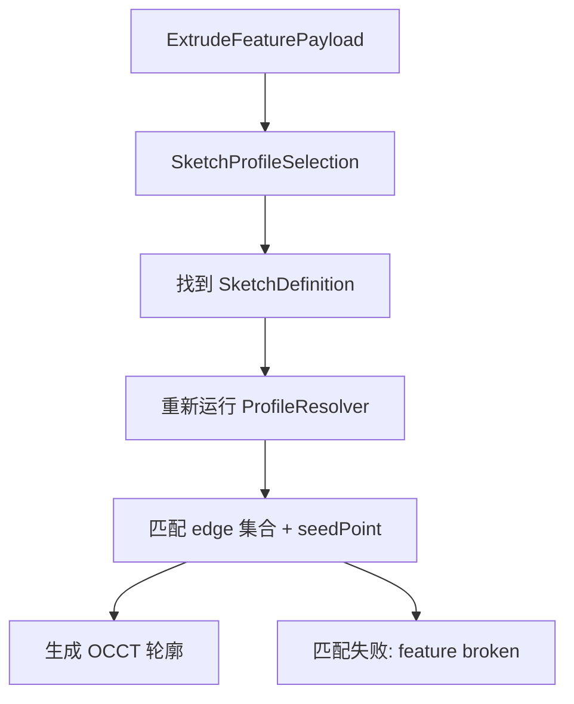

匹配策略：

1. 优先匹配 `outerEdgeIds / innerEdgeIds` 相同的 Profile。
2. 如果存在多个候选，用 `seedPoint` 判断。
3. 如果 edge 集合变化但 `seedPoint` 仍落在唯一 Profile 内，可按产品策略自动跟随。
4. 如果无法唯一匹配，特征进入 broken 状态。

## 约束与标注

约束和标注保存到 `SketchDefinition`，求解器可以在 `constraints` 包中实现。

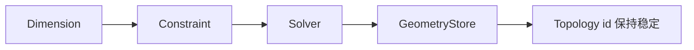

`sketch` 提供：

- 稳定的 vertex / edge / curve / point id。
- 统一 `SketchRef`。
- 草图局部坐标。
- Profile 派生结果。

`constraints` 提供：

- 约束数据模型。
- 尺寸数据模型。
- 求解输入输出。
- 对 `GeometryStore` 的更新建议。

约束落地前，草图仍必须能自由绘制和编辑。约束落地后，拖动和尺寸驱动优先更新 geometry，不轻易重建 topology。

## 实施顺序

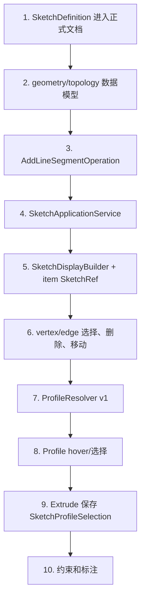

第一阶段验收标准：

- 草图数据不再长期存放在 `EditorState.sketchesById`。
- 新增直线通过 `DocumentOperation` 修改正式文档。
- 直线在模型中创建 point geom、vertex、line curve、edge。
- 渲染和拾取能回到 `SketchRef`。
- 现有基准面建草图和直线绘制行为不回退。

## 当前不要做的事

- 不继续基于 `Sketch.entities[]` 堆圆、矩形、Profile。
- 不让 command 直接创建 point / line / edge。
- 不让 `cad-rendering` 直接散读草图内部结构。
- 不让 `webgl-engine` 知道草图语义。
- 不先做复杂约束求解。
- 不先做拉伸实体生成。
